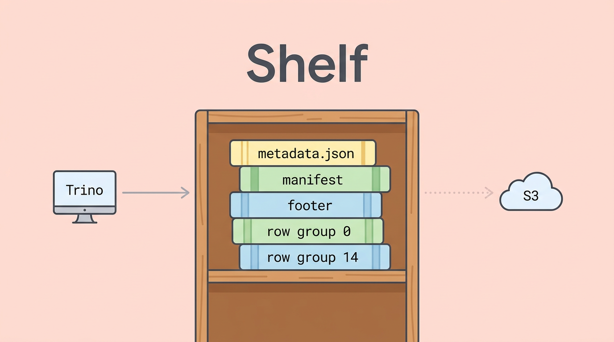
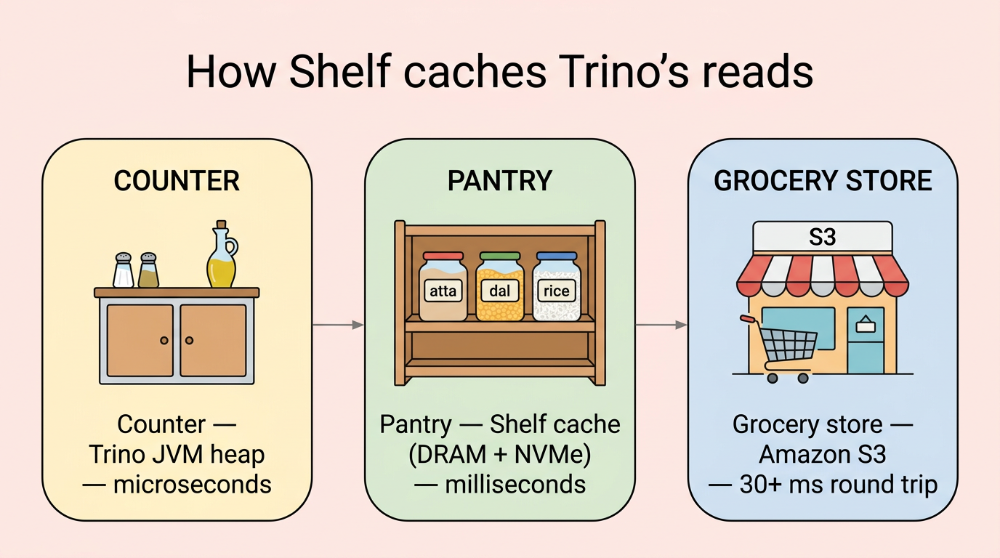
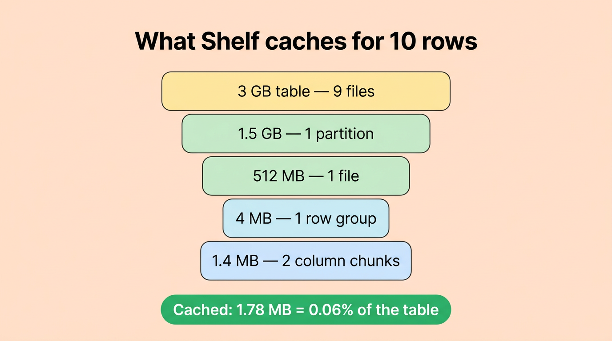
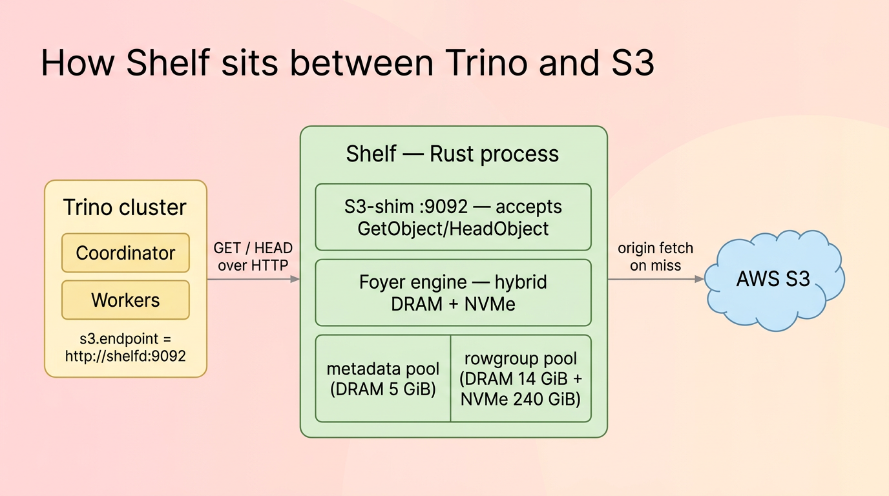
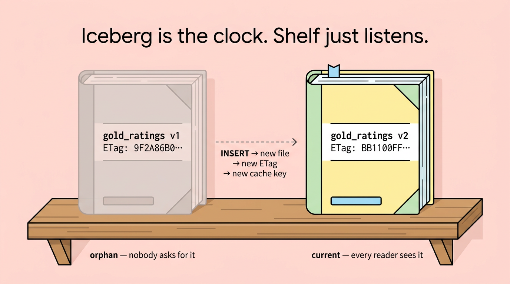
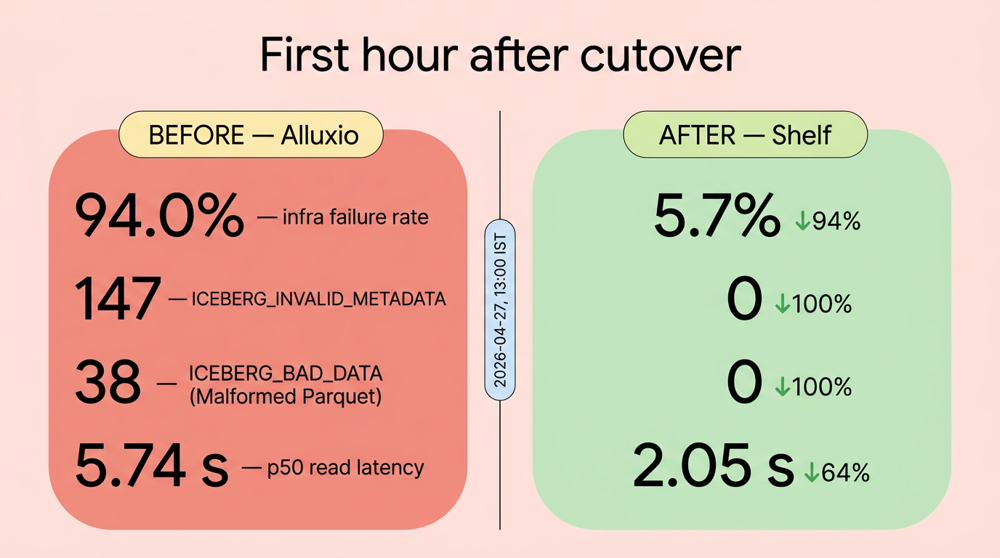

# Shelf

  

  <em>A row-group-granular, plan-aware, Iceberg-native read cache for Trino. Rust, Apache 2.0, fail-open.</em>

  
  
  
  
  
  

---

## What is Shelf?

Trino on Iceberg makes a lot of small, repeated reads to S3 — `metadata.json`, manifest files, Parquet footers, and the row groups themselves. None of those bytes change between snapshots, but without a cache, every query asks S3 the same questions again, in HTTP, paid round-trip after paid round-trip.

Shelf is a small Rust process that pretends to be S3. Trino is told `s3.endpoint=http://shelfd:9092` — one config line — and Shelf either serves the bytes from its own DRAM + NVMe cache or proxies the request to real S3, learns from the answer, and remembers it for next time.

  

> *If Trino is the librarian and S3 is the warehouse, Shelf is the front desk — every request goes through it, and most of the time it already has the book in the drawer.*

## Why Shelf

- **Row-group granularity.** Keys are `sha256(etag || offset || length || rg_ordinal)`. Shelf caches the 64 KB Parquet footer or a single 4 MB row group, not the whole 512 MB file. A `LIMIT 10` query against a 3 GB table caches **~1.78 MB** — the byte ranges that survive Iceberg + Parquet pruning, nothing more.
- **Iceberg-clock freshness.** The S3 ETag is part of every cache key. New snapshot → new file → new ETag → new key. Old entries become unreachable orphans Foyer evicts on capacity. **No TTLs, no invalidation queues, no stale-read class of bug.**
- **Plan-aware prefetch.** A Trino coordinator plugin warms file and footer bytes while the planner is still assigning splits. Row-group prefetch is plugin-observation-driven; no dependency on the removed `SplitCompletedEvent`.
- **Shared across replicas.** One cluster, multiple Trino replicas, one warm working set. No more cold-start tax per replica.
- **Consensus-free.** Membership is the K8s headless service. Pin list and tenant quotas are a versioned S3 ConfigMap. No Raft, no etcd.
- **Fail-open.** If a Shelf pod is unreachable, the Trino plugin (read-path SPI when available) falls through to direct S3 with a circuit breaker per pod — never block a query on a cache miss.
- **HTTP/2 in v1.** One protocol, one pool to tune. Arrow Flight is deferred to v1.x contingent on measured EKS throughput.

  

## How it works

One Rust binary, one container per pod, one pod per cache node. Two Foyer pools share the disk — small things like manifests and footers stay in DRAM, large row-group bytes spill to NVMe.

  

The S3-shim on `:9092` accepts `GetObject` and `HeadObject` over HTTP, ignoring SigV4 signatures by design (Shelf is a sidecar, not a multi-tenant gateway). It supports suffix byte-ranges (`bytes=-100`) and open-ended ranges (`bytes=0-`) — the shapes Trino's native S3 client uses for Parquet/Avro footer reads.

The Foyer engine is a hybrid DRAM + disk cache. The two pools differ because their access patterns differ:

| Pool | Lives on | Tuned for | Typical entry |
|---|---|---|---|
| **metadata** | DRAM only | High request rate, small entries | Iceberg manifest, Parquet footer |
| **rowgroup** | DRAM + NVMe spill | High byte volume, range reads | Parquet column chunk |

Mixing them in one pool would have eviction policies fighting each other.

## The Iceberg-clock trick

Every cache eventually faces the same question: *what happens when the data changes?* Most caches answer with TTLs, invalidation queues, or pub/sub on writes. Shelf doesn't have any of those — only the ETag-keyed cache key.

  

When Iceberg commits a new snapshot, the writer produces a **new** Parquet file with a **new** ETag. The cache key for any byte range of the new file is mathematically different from the old one. The old entry isn't "invalidated" — it just becomes unreachable, an orphan that Foyer eventually evicts on capacity.

> *Iceberg is the clock; Shelf just listens.*

## Real-world impact

Numbers from a four-replica Trino-on-Iceberg cluster running ~250 K queries/day, captured in the first hour after cutover from a previous cache layer to Shelf on a single canary replica:

  

| Metric | Before | After | Δ |
|---|---:|---:|---:|
| Infra failure rate | 94.0 % | 5.7 % | **−94 %** |
| `ICEBERG_INVALID_METADATA` | 147 | 0 | **−100 %** |
| `ICEBERG_BAD_DATA` (Malformed Parquet) | 38 | 0 | **−100 %** |
| `ICEBERG_CANNOT_OPEN_SPLIT` | 111 | 13 | −88 % |
| p50 read wall time | 5.74 s | 2.05 s | **−64 %** |

These are measured-cluster numbers from `trino_queries` event-listener tables and `shelfd:9090/metrics` — not vendor benchmarks. Reproducer scripts and full methodology are in [docs/](./docs/).

### Sustained results (second replica, business-hours comparison)

A second replica was cut over and measured over a full 7-day baseline (direct S3) versus the post-cutover window (Shelf), filtered to business hours only (9 AM–9 PM) and excluding the cutover day to avoid cold-cache contamination:

| Metric | Direct S3 (7-day baseline) | Shelf (post-cutover) | Delta |
|--------|---------------------------|---------------------|-------|
| **p50 wall time** | 2.34 s | 1.12 s | **−52 %** |
| p95 wall time | 1,112 s | 1,107 s | ~same |
| p99 wall time | 1,272 s | 1,232 s | −3 % |
| Avg CPU time | 197.7 s | 152.4 s | **−23 %** |
| Avg planning time | 0.46 s | 0.37 s | −19 % |
| `ICEBERG_BAD_DATA` errors | 10 | **0** | **eliminated** |
| `CLUSTER_OUT_OF_MEMORY` | 62 | 9 | −85 % |

**Warm-up curve:**

| Phase | p50 wall | Iceberg infra errors |
|-------|----------|---------------------|
| 0–6 h (cold cache) | 3.3 s | 5 |
| 6–12 h (warming) | 85.1 s* | 0 |
| 12 h+ (warm) | **2.87 s** | 40 |

\* Inflated by scheduled batch ETL, not cache performance.

The sustained numbers confirm: **p50 latency halved**, CPU time dropped 23 % (workers spend less time blocked on I/O), and the `ICEBERG_BAD_DATA` "Malformed Parquet" corruption class — caused by proxy byte-truncation under connection-pool saturation — is structurally impossible with ETag-keyed content-addressed caching. No new failure class was introduced.

## Quickstart

Zero to first cache hit on a laptop, in ≤ 10 minutes with k3d + MinIO:

→ [docs/quickstart/](./docs/quickstart/index.md)

### Or: install via an LLM agent (no Trino / Helm / K8s expertise required)

Drop a Cursor / Claude / generic agent into your repo with this prompt:

> *"Install Shelf for me — read [.cursor/skills/install-shelf/SKILL.md](./.cursor/skills/install-shelf/SKILL.md) and follow it end-to-end."*

The skill walks the agent through detecting your Trino cluster, installing Shelf via Helm with sensible defaults, smoke-testing the S3 shim, flipping Trino's `s3.endpoint`, validating the cutover, and rolling back on signal. The user only confirms cluster-mutating steps; the agent does the work.

## Architecture

User-facing summary of the BLUEPRINT with ADR overrides applied:

→ [docs/architecture.md](./docs/architecture.md)

Full canonical design: [BLUEPRINT.md](./BLUEPRINT.md).

## "Trino is slow — should I reach for Shelf?"

If you're trying to figure out whether Shelf is the right answer for your specific bottleneck (or whether the right fix is JVM tuning, query rewrite, Alluxio, native `fs.cache`, or "do nothing"):

→ [docs/discovery/trino-is-slow.md](./docs/discovery/trino-is-slow.md) — decision tree by symptom, with the profile-before-you-cache step first.

→ [docs/discovery/alternatives.md](./docs/discovery/alternatives.md) — Shelf vs Alluxio vs Warp Speed vs native, with the trade-offs spelled out.

→ [docs/discovery/trino-upstream-strategy.md](./docs/discovery/trino-upstream-strategy.md) — how Shelf engages with Trino OSS to land native blob-cache integration ([trinodb/trino#29184](https://github.com/trinodb/trino/pull/29184)) over time.

## Where else does Shelf fit?

Strip away the Trino-and-Iceberg framing and Shelf is an **S3-API-compatible byte-range cache** with ETag-based freshness. It works anywhere clients do repeated byte-range reads of the same S3-compatible objects and you control the S3 endpoint they talk to:

- **Spark / Presto / Impala / Dremio / Drill on Iceberg, Delta, or Hudi** — same `s3.endpoint` override pattern, same wins.
- **ClickHouse external tables and S3 disk** — repeated byte-range reads from Parquet and ClickHouse native format.
- **DuckDB / Polars / Lance in shared notebook environments** — one warm copy serves every analyst.
- **AI/ML training datasets on S3** (PyTorch `webdataset`, Mosaic StreamingDataset, parquet/lance shards) — the textbook shared-pantry case for many workers re-reading the same shards across epochs.
- **Cloud-Optimized GeoTIFFs, Zarr, HDF5 on S3** — formats designed for byte-range reads, hit Shelf's sweet spot.

Won't help: closed managed services where the S3 endpoint isn't yours to redirect (Snowflake, BigQuery, Athena, Redshift), or workloads where every read is unique.

## License

Copyright 2026 The Shelf Authors.

Licensed under the Apache License, Version 2.0 (the "License"); you may not use this project except in compliance with the License. You may obtain a copy of the License at <http://www.apache.org/licenses/LICENSE-2.0>. See [LICENSE](./LICENSE) and [NOTICE](./NOTICE) for details.
