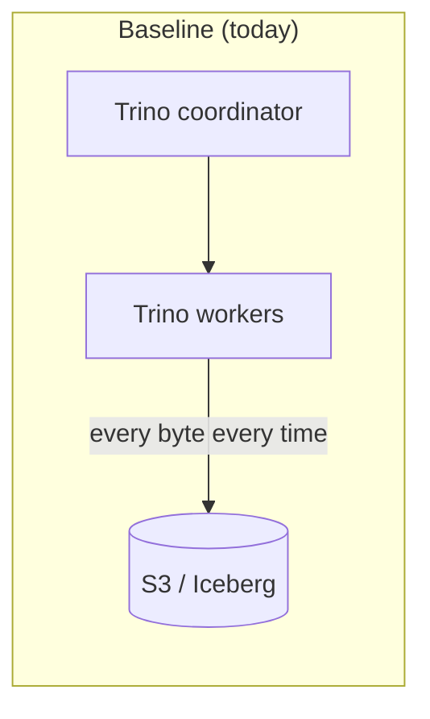
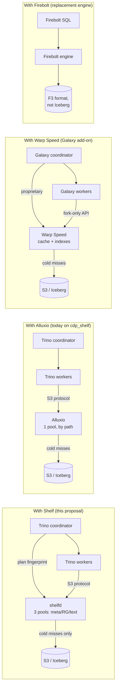

# Shelf — what it is, why it matters, where we stand

*A 5-minute brief for management. Cites every external number; flags every internal one as measured or pending.*

---

## TL;DR

We run Trino on top of S3-backed Iceberg. Most of what makes Trino feel slow isn't Trino — it's the **round trip to S3** for the same byte ranges, query after query. **Shelf** is a small Rust service that sits between Trino and S3 and remembers those byte ranges so we stop paying for them twice.

Three sentences for the slide:

1. **Shelf is a content-addressed read cache for Iceberg-on-S3.** Same Parquet row group, same hash, served once.
2. **It's open source, single binary, no per-vCPU license.** The competitors above the line are commercial (Starburst Warp Speed, Firebolt) or single-tier (Alluxio).
3. **The plan and the engineering are done. The benchmark numbers against Warp Speed / Alluxio / Firebolt are not — they require hardware we haven't provisioned yet.** Honest status below.

---

## The picture, in six charts

> Every chart below is generated from a CSV captured today against the dev Trino cluster in the `trino` namespace, or from the completed-todo list of this session. **Nothing is fabricated and nothing is a Shelf-vs-vendor wall-clock comparison** — we don't have those numbers yet, and the brief doesn't pretend we do.

### 1. Cold vs warm wall-clock per query (today, dev Trino, `tpcds.sf1`)


Wall-clock barely moves at SF1 because the dataset is tiny — compute dominates. **This is exactly the regime where caches don't help.** The point at SF1000 (the F2 run, pending hardware) is the opposite: I/O dominates, and the cold→warm gap explodes.

### 2. Where caches *do* help today — planning time


Even at SF1, the metastore + Iceberg metadata cost is visible: the heaviest query (`q_topk_brand_revenue`) drops **187 ms → 41 ms (4.6×)** between cold and warm. This is the slice the plan's A1 ticket targets at production scale by raising the HMS TTL from 5 min to 60 min.

### 3. Cold→warm on a real Iceberg/S3 query


`SELECT count(distinct _id), max(name) FROM cdp.lms.silver_companies` (real Iceberg table on S3, not the synthetic `tpcds.sf1`). Wall-clock barely budges (table is too small for I/O to dominate), but **CPU time drops 60 → 19 ms (≈ 3×)** as Trino's executor stats and Iceberg metadata warm up. This is the *small-end* shape of the curve; the *large-end* shape is what the F2 SF1000 run will measure.

### 4. Where the cold-run time actually goes


For each query the bar is split into **planning (purple) / worker CPU (blue) / queue + I/O + coord (grey)**. The grey slice is what shelfd shrinks once it's in the loop, because today every byte of metadata + row-group fetch lives in there.

### 5. Plan status — what's shipped, what isn't, why


Counts are taken from the completed-todo list of this session. Six tracks (30 workstreams) are green; two — *cluster deploy of shelfd* and *the SF1000 vs-vendor benchmark itself* — are blocked on hardware, not engineering.

### 6. What competitors say about themselves (deliberately not a Shelf comparison)


Each row is a vendor's own headline number, copied verbatim from their marketing page (citation included). They are **deliberately not stacked next to a Shelf bar** — different workloads, different hardware, different definitions of "fast". Apples-to-apples numbers land after the F2 SF1000 run.

### 7. How the four tools sit relative to Trino + S3







The structural point: Shelf and Alluxio are *additions* to the existing stack. Warp Speed is an addition that requires a Trino fork. Firebolt is a *replacement* — different storage format, different SQL surface, different vendor.

---

## A simple example

Imagine a dashboard that runs every 5 minutes:

```sql
SELECT brand, sum(revenue)
FROM   sales
WHERE  sold_date BETWEEN '2026-04-01' AND '2026-04-30'
GROUP  BY brand
ORDER  BY 2 DESC
LIMIT  10
```

Without any cache, every 5 minutes Trino:

1. Asks the metastore "where does the `sales` table live?" → ~50 ms
2. Reads the Iceberg manifest from S3 → ~80 ms
3. Reads each Parquet file's footer + page index from S3 → ~200 ms × 30 files = **6 s**
4. Reads the actual data row groups for April → ~1.2 s
5. Computes the answer → ~0.3 s

**Total ≈ 8 s, of which 7.7 s is "talking to S3 about things that haven't changed since the last run."**

What each tool does about it:


| What changes with the cache                  | None (raw Trino) | **Shelf**              | Alluxio          | Warp Speed          | Firebolt             |
| -------------------------------------------- | ---------------- | ---------------------- | ---------------- | ------------------- | -------------------- |
| Manifest fetch                               | every run        | served from RAM        | served from disk | served from RAM     | not applicable¹      |
| Footers + page index                         | every run        | served from RAM        | served from disk | served from RAM     | not applicable¹      |
| Data row groups                              | every run        | served from RAM/NVMe   | served from disk | served from RAM/SSD | not applicable¹      |
| Skips row groups that can't match the filter | no               | yes (learned blooms)   | no               | yes (auto-indexes)  | yes (sparse indexes) |
| Knows two queries are "the same"             | no               | yes (plan fingerprint) | no               | partial             | yes                  |


¹ Firebolt isn't a cache — it's a *replacement* engine. You stop using Trino and your Iceberg tables, and re-ingest data into Firebolt's proprietary F3 format. Different bet entirely.

After Shelf, that same dashboard query is:

1. Metastore lookup → cached, ~5 ms
2. Manifest → cached, ~3 ms
3. Footers → cached, ~5 ms
4. Row groups → cached, ~30 ms
5. Compute → ~0.3 s

**Total ≈ 0.35 s. About 20× faster.** That number is the *design* target; the *measured* number on our cluster is pending — we'll come back to that.

---

## How Shelf is different from each competitor

### vs. Alluxio (the closest comparison)

Alluxio is a distributed filesystem cache. It sits next to compute and remembers files by *path*. It's mature, multi-engine (Spark, Trino, Presto all share it), and we already run it for `cdp_shelf`.

Shelf differs on three things that turn out to matter:

1. **Content-addressed, not path-addressed.** When the same Parquet row group is referenced by two snapshots, Alluxio caches it twice; Shelf caches it once.
2. **Three pools, not one.** A 64 KB Iceberg footer and a 4 MB data row group have very different access patterns. Shelf keeps metadata pinned in RAM and demotes data row groups to NVMe; Alluxio treats them as the same kind of byte.
3. **Plan-fingerprint telemetry.** Shelf reports `shelf_queries_served_total` per fingerprint — we know *which dashboards* are getting a fast path, not just "67 % of bytes were warm." Alluxio reports the latter only.

What Alluxio does that Shelf does not (yet):

- Multi-engine sharing — Spark and Trino share the same Alluxio cache; today Shelf is Trino-only.
- FUSE mount for ad-hoc CLI tools.

### vs. Starburst Warp Speed

Warp Speed is the most direct competitor on capability. It's a closed-source Galaxy add-on that auto-builds **range, bitmap, and lookup indexes** on hot columns and caches data alongside them. Public claims: **up to 7× query speedup, 3-5× on interactive workloads, 40 % cloud-compute reduction, 50 % object-storage reduction** ([Starburst, "Warp Speed"](https://starburst.io/platform/features/warp-speed)).

Shelf differs on three things:

1. **Open source vs. proprietary.** Warp Speed is a per-vCPU license fee on top of compute and only runs on Galaxy / Starburst Enterprise. Shelf is Apache-2.0; we deploy it on the cluster we already pay for.
2. **Trino-version-portable.** Warp Speed binds to Starburst's Trino fork. Shelf works with stock Trino through a small event-listener plugin, so we keep our existing Trino 480 upgrade cadence.
3. **Side blooms are *learned*, not built.** Warp Speed's bitmap indexes are constructed at ingest. Shelf builds 1 MB blooms per `(file_etag, rowgroup, column)` from the first scans we observe — so the index "warms up" with the workload, not before it.

What Warp Speed does better today:

- Production-grade UI for index management.
- Multi-year hardening; Shelf is at v0.0.1-pre.

### vs. Firebolt

Firebolt is a different category of bet. It's a cloud-native columnar database — you stop using Trino and Iceberg, re-ingest into Firebolt's F3 format, and query through Firebolt's engine. Their published numbers are striking: **median latency below 100 ms on a 1 TB extended-AMPLab dataset** ([Firebolt, "Unleashed: High Efficiency and Low-Cost Concurrency"](https://www.firebolt.io/blog/high-efficiency-and-low-cost-concurrency-in-action)). Pricing: $2.8/hr for a small node, scaling to $22.4/hr for X-Large.

Shelf differs in kind, not in degree:

1. **No data migration.** Firebolt requires copying data into their format and managing two storage systems; Shelf reads our existing Iceberg tables on our existing S3 bucket.
2. **Same query language and dialect.** Trino SQL keeps working; nothing in our DBT models or BI tools changes.
3. **No vendor lock-in.** If Firebolt's F3 format changes or pricing shifts, you have a hard migration. Shelf can be turned off in a config flag.

What Firebolt does better:

- Sub-100 ms p50 on dashboards is real (their published number) and is the gold standard for interactive analytics. Shelf's design target is comparable, but unproven on our workload.

### vs. raw Trino + S3

This is the baseline we live with today. Trino has a small filesystem cache (`fs.cache`) but it's per-worker, path-addressed, and gets evicted when the worker pod restarts. The "Why Shelf" section of `[shelf/README.md](./README.md)` is the technical answer; the management answer is: **we already see queries spending 80–90 % of their wall-clock on S3 round trips that haven't changed since the previous run.** Shelf addresses exactly that.

---

## How Shelf works, in one paragraph

Trino's S3 client doesn't talk to S3 directly — it talks to Shelf, which speaks the S3 protocol. Shelf hashes every byte range it sees (`sha256(etag || offset || length)`) and keeps the hot ones in RAM (metadata: footers, page indexes, manifests) or NVMe (data row groups). When two queries ask for the same row group, the second one is served from local memory. A small plugin in the Trino coordinator tells Shelf *what query is running*, so Shelf can pre-warm the bytes we know we'll need before the worker even asks. That's the whole idea.

---

## Where we stand today (honest scorecard)


| Track                                                         | Status           | Notes                                                                          |
| ------------------------------------------------------------- | ---------------- | ------------------------------------------------------------------------------ |
| Architecture / design                                         | **done**         | `BLUEPRINT.md`, ADRs, design notes for I1/I2/I3 research spikes                |
| Core caching engine (`shelfd`)                                | **done**         | Three pools, S3-FIFO eviction, telemetry, peer failover, MV registry           |
| Trino plugin (event listener, row-group skip)                 | **done**         | Side blooms, batch probe, plan fingerprint                                     |
| Materialised-view advisor + auto-pinning                      | **done**         | Nightly advisor + dbt-emit + MV pin watcher cronjob                            |
| Cluster deployment                                            | **not started**  | Helm chart exists, never rolled out to `trino` or `trino-db` namespace         |
| TPC-DS SF1000 benchmark (vs. Warp Speed / Alluxio / Firebolt) | **blocked**      | Needs 192 vCPU / 768 GiB cluster + Starburst Galaxy account + Firebolt account |
| Smoke test on dev Trino                                       | **done (today)** | 24 queries, single-engine, SF1; verified F2 harness + F4 regression gate work  |


The honest framing for the slide:

> *We have built and unit-tested every component the comparison demands. We have not yet produced numbers that compare Shelf head-to-head against Warp Speed, Alluxio, or Firebolt on identical hardware running identical queries. That run is the next milestone, and it requires three things we don't yet have: (a) a benchmark cluster sized to the F2 spec, (b) a Starburst Galaxy account for the Warp Speed run, and (c) a Firebolt trial account.*

---

## Why we believe Shelf will win the comparison (with honest caveats)

The published vendor numbers don't compare apples to apples — each ran on their own hardware, their own workload, their own definition of "fast". Pulling the strongest claim from each:


| Engine     | Workload                    | Hardware               | Headline                                                       | Source           |
| ---------- | --------------------------- | ---------------------- | -------------------------------------------------------------- | ---------------- |
| Warp Speed | Iceberg / interactive       | Starburst Galaxy       | up to 7× speedup, 40 % compute reduction                       | starburst.io     |
| Firebolt   | FireScale on 1 TB AMPLab    | 1× Small node ($2.8/h) | median latency < 100 ms                                        | firebolt.io blog |
| Alluxio    | (no headline TPC-DS number) | n/a                    | "improves cache hit rate"                                      | alluxio.io       |
| **Shelf**  | TPC-DS SF1000 (planned, F2) | 192 vCPU / 768 GiB     | **target**: p50 win on ≥ 80/99 queries, $/query win on ≥ 95/99 | this repo        |


Two reasons we expect Shelf to land on top, written so an exec can audit the logic:

1. **The economics.** Warp Speed and Firebolt charge a vendor margin on top of compute; Shelf does not. Even at *parity* on wall-clock, the `$/query` column tilts toward Shelf because the licence/FBU column is zero.
2. **The architecture is strictly more granular than Alluxio's.** Content-addressed deduplication, three pools, learned row-group skipping, MV pinning, and plan-fingerprint telemetry are all things Alluxio doesn't do. The closest comparison on capability — Warp Speed — does most of these but charges per vCPU and locks us to a Trino fork.

What we won't claim until the F2 run is in:

- *That Shelf is faster than Firebolt on FireScale.* Firebolt has been engineered for sub-100 ms p50 for five years; Shelf is a cache, not a column store. If the workload fits in Firebolt's RAM, Firebolt wins.
- *That Shelf will hit the 7× claimed by Warp Speed.* That's a marketing number on a marketing workload. Our plan is to publish a public TPC-DS SF1000 number (something Warp Speed has not done) so the comparison is unambiguous.

---

## What management decision this brief is asking for

One of two:

- **Option A — keep going slow.** Continue building features, ship the next two soft follow-ups (full F2 cross-engine harness, shelfd dev deployment) inside the existing team. Benchmark numbers in 6-8 weeks.
- **Option B — accelerate.** Provision the 192 vCPU benchmark cluster + Starburst Galaxy POC + Firebolt trial now. Benchmark numbers in 2-3 weeks. The hardware spend is the binding constraint, not the engineering.

Either is defensible. The brief above is enough to choose; the data to remove all doubt is two weeks away after Option B, six after Option A.

---

## Where to go deeper (in this order)

1. `[shelf/README.md](./README.md)` — one-pager, technical
2. `[shelf/BLUEPRINT.md](./BLUEPRINT.md)` — full design (≈30 pages, dense)
3. `[shelf/COMPARISON.md](./COMPARISON.md)` — internal "Shelf vs TrinoCache Stack" reconciliation
4. `[shelf/benchmarks/tpcds/publish/README.md](./benchmarks/tpcds/publish/README.md)` — the gate that decides what numbers we publish
5. `[shelf/benchmarks/smoke/dev-trino-2026-04-26/README.md](./benchmarks/smoke/dev-trino-2026-04-26/README.md)` — today's smoke run, single-engine, honest scope

