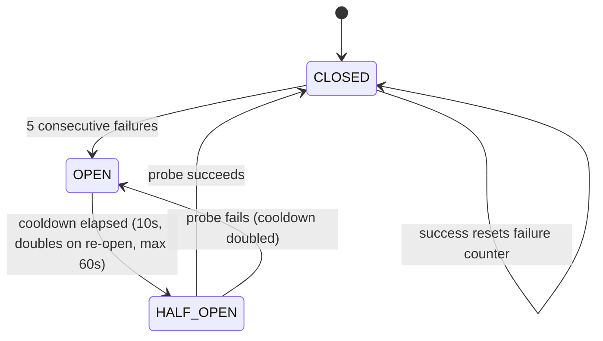

# shelf-trino-plugin

Trino 480 plugin for **Shelf** — a Rust, Iceberg-native, row-group-granular
read cache. The plugin ships two SPI artifacts in one JAR:

- `ShelfFileSystem` (`io.trino.filesystem.TrinoFileSystem`) — per-prefix read
  interception that falls through transparently to S3 on any Shelf failure.
- `ShelfPrefetchListener` (`io.trino.spi.eventlistener.EventListener`) —
  coordinator-side plan-aware prefetch (file + footer only, per ADR-0005).

Status: **skeleton / Phase 0 scaffolding**. Every method body is a TODO
tagged with the ticket ID that lands its real implementation. The compile
is green; packaging is wired; unit-test shape is in place; the wire-level
behaviour is not.

See `shelf/agents/out/03-plan.md` §3 Phase 0/1 for ticket ownership.

## Requirements

- **Maven 3.9+** (no wrapper committed; use your system `mvn`).
- **JDK 25** on `JAVA_HOME`. Eclipse Temurin 25 verified. Trino 480 publishes
  `trino-spi` as class-file major 69 (JDK 25), so JDK 21/22/23/24 cannot
  load it even at compile time. The Phase 0 scaffolding task asked for
  Java 21; we record the forced bump as a deviation in
  `docs/design-notes/README.md`.
- Trino 480 (coordinator + workers) at runtime; `trino-spi` and
  `trino-filesystem` are `provided`-scope dependencies.

## Build

```bash
mvn -B -DskipTests compile      # compile only (scaffolding gate)
mvn -B verify                    # full build + tests (tests currently @Disabled)
mvn -B package                   # shaded JAR in target/
```

License headers are enforced at the `validate` phase by `license-maven-plugin`;
missing headers fail the build.

## Layout

```
clients/trino/
├── pom.xml
├── src/main/java/io/shelf/
│   ├── filesystem/       # ShelfFileSystem, Factory, InputFile, InputStream
│   ├── client/           # ShelfHttpClient, CircuitBreaker, HashRing
│   ├── eventlistener/    # ShelfPrefetchListener, PrefetchClient
│   ├── config/           # ShelfConfig
│   └── plugin/           # ShelfPlugin (SPI root)
├── src/main/resources/META-INF/services/io.trino.spi.Plugin
├── src/test/java/io/shelf/   # mirrored @Disabled skeleton tests
└── docs/
    ├── config.md             # every config key, default, range, note
    ├── design-notes/         # per-ticket design notes
    ├── PR/                   # per-ticket PR descriptions
    └── CHANGELOG.md          # Keep a Changelog
```

## Key design invariants

- **Fail-open.** Every Shelf-originated failure is caught inside the plugin
  and degraded to a direct-S3 read (BLUEPRINT §9.5). Trino never sees a
  Shelf-specific exception.
- **HTTP/2 only in v1.** No Arrow Flight. See
  `shelf/agents/out/adr/0004-http2-only-in-v1.md`.
- **Plugin-observation-only row-group prefetch.** No `SplitCompletedEvent`
  (removed in Trino PR #26436). See
  `shelf/agents/out/adr/0005-drop-splitcompleted-event-path.md`.
- **No non-SPI Trino dependencies.** The plugin references only
  `io.trino.spi.*` and `io.trino.filesystem.*` (the documented plugin-visible
  filesystem SPI).

## State machine (CircuitBreaker, BLUEPRINT §9.5)



Semantics (see [`io.shelf.client.CircuitBreaker`](src/main/java/io/shelf/client/CircuitBreaker.java)):

- **CLOSED** — all requests dispatched; any success clears the rolling failure
  counter; five consecutive failures trip the breaker.
- **OPEN** — every `tryAcquire()` short-circuits to the fail-open path
  (direct-S3 fallback) until the cooldown expires. Initial cooldown is 10 s;
  it doubles on each re-open up to a 60 s ceiling and resets on the first
  successful `HALF_OPEN` probe.
- **HALF_OPEN** — exactly one in-flight probe is admitted. Success → `CLOSED`,
  cooldown reset. Failure → back to `OPEN`, cooldown doubled.

Covered end-to-end by [`io.shelf.client.CircuitBreakerTest`](src/test/java/io/shelf/client/CircuitBreakerTest.java)
(12 cases across the full state surface, including exponential-backoff bounds
and single-probe admission in `HALF_OPEN`).
