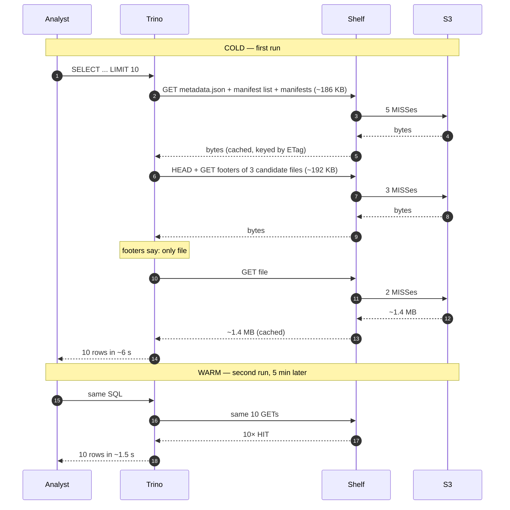

# Off the Shelf: The Cache We Built When Alluxio Ran Out of Room

*A field note on what happens between Trino and S3 — and what we learned by listening to it.*

Shelf — a wooden shelf holding metadata.json, manifests, footers and row groups, sitting between Trino and S3
*Caption: every Iceberg read is really a stack of small things — manifests, footers, row groups. Shelf is where they live between visits to S3.*

> **Publishing notes (delete on publish)**
>
> - Target space: **DEA** (Data Engineering)
> - Suggested parent: same parent as *Putting a Turbo on Trino: Our Alluxio Cache Story* (`/wiki/spaces/DEA/pages/2077753357`)
> - **Publish format: ADF** (markdown publish strips coloured panels and lozenges)
> - All blocks marked `:::panel` below become coloured ADF panels at publish time
> - All six images are in the same folder as this `.md`; attach all to the page on publish

---

:::panel type="info"
**TL;DR** — We were running 2–3 lakh Trino queries a day across four replicas, and every one of them was re-asking S3 the same questions. We tried three caches. The one that finally worked was a 12 000-line Rust process called Shelf that pretends to be S3, caches **byte ranges** (not files), and uses Iceberg's own ETag as the freshness gate. After cutover, infra failure rate on the canary replica dropped **94 % → 5.7 %** in one hour, and p50 read latency fell **5.74 s → 2.05 s**.
:::

---

## The Slack message

The message came in at 1:47 PM IST on a Thursday:

> *"rep-2 is timing out again, getting Malformed Parquet on tables that worked an hour ago"*

The query plans looked normal. The Parquet files were not corrupt — `aws s3 cp` of the same manifest returned the same correct bytes. What was breaking was the **path between Trino and S3**: our Alluxio S3 proxy had run out of connections in its pool, and any read whose timing was unlucky enough to land during the burst was coming back with the first 0–3 bytes of garbage that happens when a connection is yanked mid-stream.

The cluster wasn't broken. The middleman was.

*A cache that fails partially is worse than no cache at all — at least no cache fails honestly.*

---

## What we were actually paying for

Strip away the storage layer and what Trino does on every query is roughly the same dance:


| Layer                     | What it is                                 | Typical size |
| ------------------------- | ------------------------------------------ | ------------ |
| `metadata.json`           | The Iceberg snapshot pointer               | ~12 KB       |
| Manifest list + manifests | Lists of data files for the snapshot       | ~6–80 KB     |
| Parquet **footer**        | Schema + row-group offsets + min/max stats | ~64 KB       |
| **Row group**             | Actual columnar data                       | 1–16 MB      |


A `SELECT * FROM gold_users LIMIT 100` on a 4 000-table catalog with no cache reads ~5–8 small metadata objects **just to find out where the data is**. None of them change between snapshots. Multiply by 2–3 lakh queries a day, four Trino replicas, and a fleet of spot workers KEDA rotates every few hours — and the cluster spends a non-trivial fraction of its life doing the same Internet-shaped lookup over and over.

We were not paying S3 for storage. We were paying S3 for **the privilege of asking the same question, again and again, in HTTP**.

---

## What we tried first

We did not start by building Shelf. We started by trying not to.

:::panel type="info"
**Why not just turn on Trino's `fs.cache`?** — We did. For one replica. For about an hour. Then KEDA scaled in three spot workers and 60 % of the cache walked out the door with them. Hit ratio settled at 15–20 %. *A bucket with holes is not a bucket; it's a watering schedule.*
:::

:::panel type="warning"
**Alluxio OSS bought us a year, then a wall.** — We deployed it. For months it sang — 80 % hit rate, 10-second queries running in 2. Then we hit the OSS 2.9.x ceiling. The line is **frozen on GitHub since June 2024**. Every fix that would have lifted our pool-saturation pain — SDK v2, worker-redirect read path — is gated behind **Alluxio Enterprise**. We tuned `underfs.io.threads` from 36 to 256 and bought ourselves another six months. *The math was clear: we were one workload-shape change away from being told to either pay for Enterprise or build something ourselves.*
:::

We checked off-the-shelf alternatives honestly. Meta's RaptorX is not OSS. Netflix's Iceberg-side cache is internal. Pinterest's open work solves a different problem. There was no Iceberg-aware OSS cache that could ride between Trino and S3 without a vendor licence.

So we built one.

---

## The simple idea

Picture how you cook at home.


| Tier                            | In your kitchen                           | In our stack                           |
| ------------------------------- | ----------------------------------------- | -------------------------------------- |
| **Counter** — right next to you | Salt, oil, masala — grab in one second    | Trino's JVM heap                       |
| **Pantry** — a few steps away   | Atta, dal, rice — five-second walk        | **Shelf** (DRAM + NVMe in the cluster) |
| **Grocery store** — across town | Out-of-stock items — 30-minute round trip | S3                                     |


Before Shelf, every time Trino needed a Parquet row group, it walked to the grocery store — even if the same row group had been fetched ten minutes earlier by another query. Slow, and every walk was a paid trip.

Counter → Pantry → Grocery store, the three tiers of caching
*Caption: counter (Trino heap, microseconds) → pantry (Shelf, milliseconds) → grocery (S3, 30+ ms round trip). Most reads stop at the pantry.*

Shelf is a **shared pantry** sitting next to Trino inside the same cluster. Trino is told one thing:

```properties
# cdp.properties on a Trino coordinator
s3.endpoint=http://shelfd:9092
```

That's the entire integration. No new connector, no plugin recompile, no SQL change. Trino sends `GetObject` and `HeadObject` over HTTP; Shelf either serves the bytes from its own pantry or proxies the request to real S3, learns from the answer, and remembers it for next time.

*If Trino is the librarian and S3 is the warehouse, Shelf is the front desk — every request goes through it, and most of the time it already has the book in the drawer.*

Architecture diagram showing Trino cluster on the left, Shelf in the middle with S3-shim, Foyer engine, and metadata + rowgroup pools, connecting out to AWS S3 on the right
*Caption: Shelf is one Rust process per pod. Two pools share the disk — small things in DRAM, big things spilling to NVMe. The S3 origin client is the only path out.*

---

## What Shelf actually caches — a 10-row example

The thing that surprises people most is how **little** Shelf has to cache to make a query fast.

Take a partitioned Iceberg table:

```sql
SELECT user_id, rating
FROM cdp.gold.gold_ratings
WHERE date = '2026-04-28'
LIMIT 10;
```

The table has three partitions on disk (`date=2026-04-26`, `2026-04-27`, `2026-04-28`), and the target partition has three Parquet files of ~500 MB each — **1.5 GB of data**.

Watch what actually moves:




Total bytes Shelf cached for "10 rows" — **~1.78 MB**. Out of the 1.5 GB of files in the partition, **0.12 %**. Out of the whole table across all partitions, **0.06 %**.

Funnel showing how a 3 GB table narrows down to 1.5 GB partition, 512 MB file, 4 MB row group, 1.4 MB column chunks
*Caption: every stage of the funnel happens inside Trino + Iceberg + Parquet, before Shelf is even asked. Shelf just caches what survives the bottom of the funnel.*

The "magic" is that Iceberg + Parquet do all the projection / partition / row-group pruning **before** Shelf is even asked. Shelf just caches the tiny byte ranges that survive the funnel.

---

## The Iceberg-clock trick

Every cache eventually faces the same question: *what happens when the data changes?*

Most caches answer with TTLs, invalidation queues, or pub/sub on writes. Shelf doesn't have any of those. It has **one** trick — every cache key is the SHA-256 of:

```
sha256( etag || offset || length || rg_ordinal )
```

The S3 ETag is part of the key. When Iceberg commits a new snapshot, it writes a **new** Parquet file with a **new** ETag. The cache key for any byte range of the new file is mathematically different from the old one. The old entry isn't "invalidated" — it just becomes **unreachable**, an orphan that Foyer eventually evicts on capacity.

Two Yellow-Pages-style books on a shelf — v1 greyed out as orphan, v2 highlighted as current, connected by an arrow labeled INSERT → new file → new ETag → new cache key
*Caption: a new edition of the Yellow Pages doesn't tell the old one to vacate the shelf — nobody asks for it any more, and the bookshop quietly recycles its space.*

There is no freshness window to tune. **Iceberg is the clock; Shelf just listens.**

---

## What we're seeing in production

Replica 2 was the canary cutover, on **2026-04-27 at 13:00 IST**.

Before/after comparison panel — Alluxio side showing 94% failure rate, Shelf side showing 5.7%
*Caption: same replica, same workload, same hour-of-day — only the cache underneath changed. The numbers below are the raw deltas in the first hour.*

:::panel type="success"
**First-hour deltas (rep-2, vs same hour previous day)**


| Metric                                 | Before (Alluxio) | After (Shelf) | Δ          |
| -------------------------------------- | ---------------- | ------------- | ---------- |
| Infra failure rate                     | 94.0 %           | 5.7 %         | **−94 %**  |
| `ICEBERG_INVALID_METADATA`             | 147              | 0             | **−100 %** |
| `ICEBERG_BAD_DATA` (Malformed Parquet) | 38               | 0             | **−100 %** |
| `ICEBERG_CANNOT_OPEN_SPLIT`            | 111              | 13            | −88 %      |
| p50 read wall time                     | 5.74 s           | 2.05 s        | **−64 %**  |
| Total infra failures                   | 366              | 18            | −95 %      |


Replica 1 cut over the same evening with the same shape of result. Replicas 0 and 3 are still on direct S3 while we soak.
:::

The live ops dashboard is at *Shelf — Cache, Disk and Pods* on platform-grafana (uid `shelf-overview`). Today, six hours of traffic shows a **49 % rowgroup hit ratio** while the cache is still warming, with each pod holding ~340 GB of bytes on NVMe.

---

## What's still hard

Caches are full of nice-sounding ideas that fall apart on contact with production. We're not done.

- **Pod traffic skew.** Trino's S3 client doesn't load-balance across our headless service the way an HTTP/2 client would. One Shelf pod often takes 60 % of the GETs. We've worked around it with consistent hashing on keys; bringing our own router is on the list.
- **The single `s3.endpoint`.** If Shelf is down, every Trino query against that catalog fails — no automatic S3 fallback. We mitigate with a parallel `cdp_direct` catalog so on-call can flip in seconds. The proper fix is upstream Trino's [blob-cache SPI](https://github.com/trinodb/trino/issues/29184).
- **Cold-cache thundering herd.** A pod restart means 100 % miss for 5–10 minutes. We pre-warm the top hot tables from a pin-list before flipping traffic. It works, but it's handcraft.
- **Learned admission.** Today we admit anything below 1 GiB. A small gradient-boosted model over query-plan features could probably double effective hit rate by simply *not* admitting one-shot scans. The plumbing exists; the model does not.

---

## What we learned

If we had to compress this whole journey into one paragraph, it would be: *we did not need a smarter cache; we needed a cache that understood Iceberg's clock.* Every line of complexity we initially planned — TTLs, invalidation queues, snapshot listeners, write-through paths — disappeared the moment the ETag became part of the cache key. Iceberg already knew when the data changed. Our job was to listen, not invent.

The other thing we learned is that the OSS line matters. We could have spent another quarter fighting Alluxio's pool ceiling, or filed a feature request that lived in someone's backlog. Building Shelf was a few engineers, a clean room, and the willingness to point at the bytes and ask *what should this even do?* When the answer is short, the code is short.

:::panel type="note"
Shelf is Apache 2.0, public at **[github.com/shelf-project/shelf](https://github.com/shelf-project/shelf)** — issues, PRs and "we tried this and it broke in a weirder way" stories all welcome.
:::

---

*If you're running Trino on object storage at any meaningful scale, the bottleneck is rarely compute — it's almost always the round trip. We hope Shelf shortens yours.*