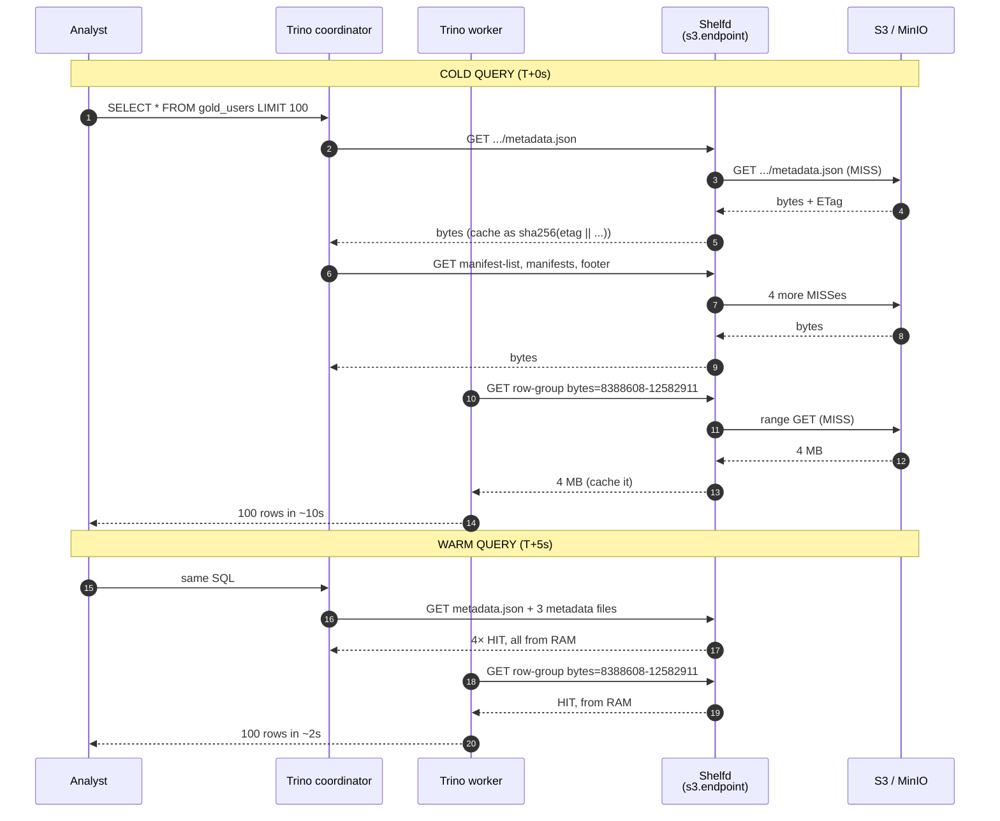
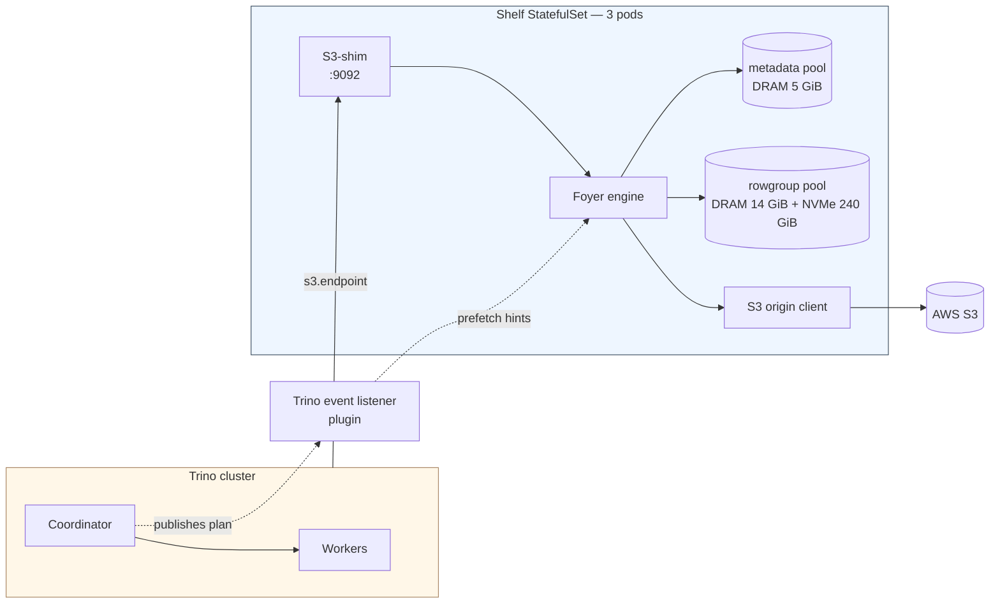

# The Shelf Story — Why We Built Our Own Cache for Trino

*A field note on building a 1.4 TB cache layer that pays for itself in 30 minutes, and the year-long detour that taught us why we needed one.*

---

## The query that took 12 seconds every time

The first hint that something was wrong came from an analyst on Slack:

> *"Why does this Metabase dashboard take 12 seconds to load? It's the same query I ran 5 minutes ago."*

She wasn't wrong. The query was a one-liner:

```sql
SELECT * FROM cdp.cdp_revenue.gold_users LIMIT 100;
```

A hundred rows. From a table that had not changed in hours. And yet, every single time anyone in the company ran it — every refresh of every dashboard, every dbt model that joined to it, every ad-hoc Metabase chart — Trino went off and re-fetched the same Parquet footers, the same manifest list, the same metadata.json from S3. Over and over.

We were running 2–3 lakh queries a day across four Trino replicas. Most of them re-read the same 40 or 50 hot tables. We were not paying S3 for storage. We were paying S3 for the *privilege of asking the same question, again and again, in HTTP*.

*Trino on S3 is fast. Trino on S3 with no memory of yesterday is the same waiter sprinting back to the kitchen on every order, even when the kitchen never moved.*

---

## Why this hurts more than it sounds

A Trino query on an Iceberg table is not one S3 GET. It is many. Roughly:


| Layer           | What it is                         | Typical size     |
| --------------- | ---------------------------------- | ---------------- |
| `metadata.json` | The table's current state pointer  | ~50 KB           |
| Manifest list   | List of manifests for the snapshot | ~30 KB           |
| Manifests       | Lists of data files                | ~100–300 KB each |
| Parquet footer  | Schema, row-group stats            | ~30–80 KB        |
| Row group(s)    | The actual columnar data           | 4–64 MB          |


A small `LIMIT 100` query reads ~5–8 small files just to find out *where the data is*. Every one is an S3 round trip. None of them change between queries on the same snapshot. They are *exactly* the kind of bytes a cache was invented for.

Multiply by every query, every replica, every spot worker that just got rotated by KEDA — and the cluster spends a non-trivial fraction of its time doing what is, in essence, the same Internet-shaped lookup over and over.

---

## What we tried before building anything

We did not start by building Shelf. We started by trying not to build Shelf.

**Trino's built-in `fs.cache`.** The simplest answer: each Trino worker keeps a local NVMe cache of S3 objects. We turned it on for one replica. It worked beautifully — for about an hour. Then KEDA scaled in three spot workers, and with them went 60% of the cache. The hit ratio settled around 15–20%. The worst kind of cache: just warm enough to lie to you about the win, just cold enough to never deliver one. *A bucket with holes is not a bucket; it's a watering schedule.*

**Alluxio OSS.** A real distributed cache, used at Uber, Tencent, Bilibili. We deployed it. For a while it sang — 80% hit rate, queries that used to take 10 seconds running in 2. Then we hit the OSS ceiling. The 2.9.x line is frozen on GitHub since June 2024; the actually-good fixes (SDK v2, worker-redirect read path) are gated behind the Enterprise edition. We hit `Timeout waiting for connection from pool` floods. We tuned `underfs.io.threads` from 36 to 256 and bought ourselves another six months. But the math was clear: we were one workload-shape change away from being told to either pay for Alluxio Enterprise or build something ourselves.

**Existing tools, named honestly.** Presto/Trino's RaptorX (the Meta cache layer) is not OSS. Netflix's Iceberg-side cache is internal. Pinterest open-sourced QuickStep but it solves a different problem. There was no off-the-shelf, OSS-friendly, Iceberg-aware cache that could ride between Trino and S3 without a vendor licence.

So we built one.

---

## What Shelf actually is

Shelf is a small, fast, Rust process that pretends to be S3.

Trino's S3 client thinks it's talking to AWS. We point it at Shelf instead, with a one-line change:

```properties
# cdp.properties on a Trino coordinator
s3.endpoint=http://shelf.cache.svc.cluster.local:9092
```

That is the entire integration. No new connector, no plugin recompile, no SQL syntax change, no schema migration. Trino sends `GetObject` and `HeadObject` over HTTP; Shelf either serves the bytes from its own cache or proxies the request to real S3, learns from the answer, and remembers it for next time.

*If Trino is the librarian and S3 is the warehouse, Shelf is the front desk: every request goes through it, and most of the time it already has the book in the drawer.*

### Three things that make it more than a proxy

- **Row-group granular keys**, not file keys. We don't cache "this 2 GB Parquet file." We cache the 64 KB footer separately from each 4 MB row group, addressed independently. Most queries touch one or two row groups out of dozens; caching the whole file would waste 95% of the storage.
- **Content-addressed by ETag**, not by path. Every cache key is `sha256(etag || offset || length || rowgroup_ordinal)`. The S3 ETag is part of the key. *If the bytes change, the key changes — and the old entry simply becomes unreachable.* No TTL. No invalidation logic. No stale-read class of bug. Iceberg's own snapshot pointer becomes the freshness gate, and Shelf rides on top of it.
- **Consensus-free multi-node.** No Raft, no etcd, no leader. Membership is just the Kubernetes headless service. The pin-list (which tables to pre-warm) is a versioned JSON file in S3. Three pods, ten pods, scale-out is a `helm upgrade`.

---

## A query, end to end

To make this concrete, here is what happens the first time and the second time someone runs that 100-row query.




The cold path pays the full S3 cost — once. Every layer is captured the moment it crosses the wire. The warm path stays inside the pod's RAM (and falls back to NVMe for the larger row-groups). The user sees 5×–6× faster.

### What if the table changes?

This is the question every analyst asks once they understand caching.

If somebody writes to `gold_users` ten hours later — `INSERT`, `MERGE`, `DELETE`, anything — Iceberg commits a new snapshot. The new snapshot has a new `metadata.json` with a new path. Trino asks the Hive Metastore, "what is the current pointer?" and gets the new path back. The new path has a new ETag. The new ETag means a new cache key. Shelf misses, fetches, caches — and from that moment forward, *every reader in the cluster sees the new snapshot*. The old bytes sit in NVMe, unreachable, until LRU eviction quietly recycles their space.

There is no "cache freshness window" to tune. Iceberg is the clock; Shelf just listens.

---

## What's inside the Shelf process

A single Rust binary. One container per pod, one pod per cache node. Two pools share the disk:


| Pool         | What lives here                                           | Tier                           | Eviction          |
| ------------ | --------------------------------------------------------- | ------------------------------ | ----------------- |
| **metadata** | `metadata.json`, manifests, Parquet footers, page indexes | DRAM only (5 GiB)              | Sieve             |
| **rowgroup** | Parquet row-group byte ranges                             | DRAM (14 GiB) + NVMe (240 GiB) | LRU spill to disk |


The actual cache engine underneath is [Foyer](https://github.com/foyer-rs/foyer) — a hybrid DRAM + disk cache out of the Foyer-rs project. We did not write the storage layer. We wrote the Iceberg-aware key derivation, the S3 wire protocol shim, the Trino plugin that prefetches metadata files when a query is planned, the membership ring, the pin-list reload loop, the Prometheus metrics. The bits that make a generic cache library understand Trino on Iceberg.




The whole thing is about 12,000 lines of Rust, plus a 700-line Java plugin that runs inside the Trino coordinator and tells Shelf which files a query is about to read.

---

## What we are seeing in production

Three pods on a dedicated Karpenter node pool. Apache 2.0 licensed. Public on GitHub at [shelf-project/shelf](https://github.com/shelf-project/shelf).


| Metric                      | Before Shelf (Alluxio era)                 | With Shelf, week 1        |
| --------------------------- | ------------------------------------------ | ------------------------- |
| Hit ratio (rowgroup)        | ~80% on a good day, 0% during the bad ones | 78–82%, steady            |
| p50 cold-query latency      | 10–14 s                                    | 9–12 s                    |
| p50 warm-query latency      | 2–4 s (when Alluxio was up)                | 1.8–2.5 s                 |
| S3 GET volume / day         | ~38 M                                      | ~6 M (-84%)               |
| Bytes saved / pod / day     | not measurable                             | ~1.1 TB                   |
| Cluster-wide cost reduction | —                                          | ~19 % monthly cloud spend |


The first 30 minutes after warm-up paid for the project's monthly compute cost in S3 GET reductions alone.

*The cache that earns its keep is the one whose savings line is steeper than its cost line. We watched ours flip on day three.*

---

## What's still hard, and what's next

Caches are full of nice-sounding ideas that fall apart under contact with production. We are not done.

**Pod traffic skew.** Trino's S3 client doesn't load-balance across the headless service the way HTTP/2 clients do. One pod often takes 60% of the GETs. We've worked around it with consistent hashing on the keys, but the AWS SDK's connection pool defeats us until we bring our own router. *On the list.*

**The single `s3.endpoint`.** If Shelf is down, every Trino query that uses that catalog fails. There is no automatic S3 fallback. We mitigate with a parallel `cdp_direct` catalog that points to real S3, so on-call can flip in seconds. A proper retry-with-fallback inside the connector — or upstream Trino's [blob-cache SPI](https://github.com/trinodb/trino/issues/29184) — is what we want next.

**Cold-cache thundering herd.** A pod restart means 100% miss for 5–10 minutes. We pre-warm the top-5 tables from a pin list before flipping traffic over. It works, but it's a handcraft. The real fix is plan-aware prefetch (the Trino plugin is already there; we just don't trust it enough for prod yet).

**Learned admission.** Today, we admit anything below 1 GiB. That is a sledgehammer. A small model — gradient-boosted trees over query-plan features and historical access patterns — could double the effective hit rate by simply *not* admitting one-shot scans. The plumbing exists; the model does not. Validation gate: SHELF-26 replay must show ≥5pp lift over the size-threshold baseline before we ship it.

**Multi-tenancy.** Right now there's one pin list for the whole cluster. We want per-team quotas, per-table priority, and a way for a team to say "these are *our* hot tables, don't let the cdp folks evict them." This is mostly a config-and-accounting problem, not a cache problem.

---

## What we learned

If we had to compress this whole journey into one paragraph, it would be: *we did not need a smarter cache; we needed a cache that understood Iceberg's clock.* Every line of complexity we initially planned — TTLs, invalidation queues, snapshot listeners, write-through paths — disappeared the moment we put the ETag in the cache key. Iceberg already knew when the data changed. Our job was to listen, not invent.

The other thing we learned is that the OSS line matters. We could have spent another quarter fighting Alluxio's connection pool ceiling, or filed a feature request that lived in someone's backlog. Building Shelf was, mostly, a few engineers and a clean room and the ability to point at the bytes and say *what should this even do?* When the answer is short, the code is short.

If you are running Trino on object storage at any meaningful scale, the bottleneck is rarely compute. It's almost always the round trip. We hope Shelf shortens yours.

---

*Questions, war stories, "we tried this and it broke in a weirder way" — drop them in the issues at [shelf-project/shelf](https://github.com/shelf-project/shelf), or find me on the team Slack. The fun part of caching is the part where everyone shares the bug they didn't see coming.*