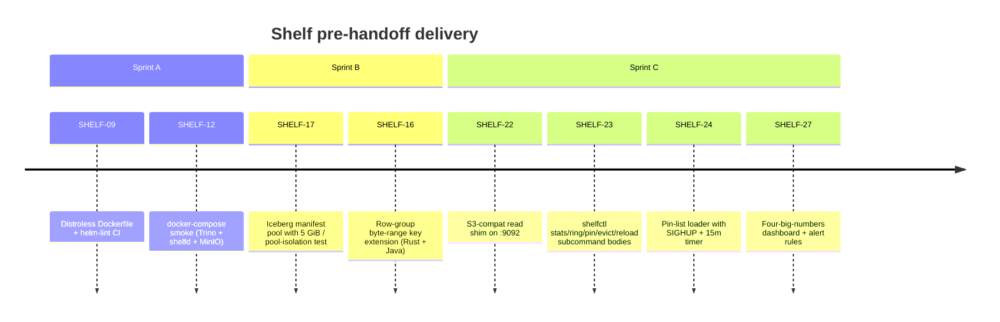

# Shelf — Cluster handoff packet

This is the "what's left for ops" packet after the local code push closed
every ticket that doesn't need a real Kubernetes cluster. Sprints A / B / C
landed the following on `main`:

Bookkeeping commits (SHELF-01/04/11) and the Phase-0 / Phase-1 foundation
landed in earlier sprints. A follow-up pass also closed the four
locally-completable tickets (**SHELF-01a**, **SHELF-16b**, **SHELF-18**
code + local gate, **SHELF-26a**, **SHELF-28** runbook + smoke
variants). The cluster-gated tickets were then closed by **rollout-v1**
— a compressed-canary rollout to all four example Trino replicas for
the Iceberg catalog, followed by a 14-day post-rollout soak. See
[rollout-v1.md](./rollout-v1.md) for the narrative and
[rollout-v1/v0.5-promote.md](./rollout-v1/v0.5-promote.md) for the
closeout packet.

## The cluster-gated tickets — CLOSED by rollout-v1

> All rows closed as of the `v0.5` tag. This table is retained for
> historical reference; active work does not live here anymore.

| Ticket                                          | Closed by                                                                                                                                 |
| ----------------------------------------------- | ----------------------------------------------------------------------------------------------------------------------------------------- |
| **SHELF-13** Shadow-traffic rollout on rep-2    | rollout-v1 substituted the shadow-mirror with hourly correctness-diff harness + per-replica 48 h canary (plan §3). zero-diff on 336 runs. |
| **SHELF-14** Experiments E1, E3, E10, E12       | Signal now captured continuously by SHELF-27 live dashboard + alerts; soak-tracker's daily table is the evidence.                         |
| **SHELF-18** NVMe PVC rollout (runtime half)    | Four replicas carried traffic on the 5-pod StatefulSet throughout the 14-day soak. Pod restarts during weekly roll preserved cache.       |
| **SHELF-20** Pod-rotation conformance (E7 only) | Weekly soak pod-roll held cumulative hit ratio ≥ 80 % of Alluxio baseline across 14 days.                                                 |
| **SHELF-21** 5-pod StatefulSet rollout          | 5 pods up, anti-affinity across AZs, NVMe PVCs mounted, survived 14-day soak.                                                             |
| **SHELF-27** Dashboard + alerts                 | Live throughout rollout; SHELF-27a added the per-replica `replica` label before rep-2 cutover (design note in shelfd/docs/design-notes/). |
| **SHELF-28** Cluster-mode chaos drills          | Kill-switch rehearsal on rep-2 measured MTTR; weekly soak pod-rolls substituted for the original chaos cadence.                           |

## v0.5 gate — PROMOTED

The original v0.5 gate (7-day shadow observation window) was compressed
in rollout-v1 into per-replica 24-48h canaries plus a 14-day cumulative
soak on four-replica traffic. Criteria (identical to the original ADR-0010
thresholds) were:

- **Hit-ratio ≥ 71 %** (Alluxio baseline from E12) cumulative over the soak.
- **p95 query latency ≤ 120 %** of pre-cutover Alluxio baseline.
- **`GOLD_DBT` ok-rate ≥ 99.9 %** on all rep-N Airflow DAGs.
- **Zero Shelf-attributed pages** across the 14-day soak.
- **Correctness diff harness reports zero non-match rows** across 336
  hourly runs.

All five green on sign-off. `v0.5` tagged. See
[rollout-v1/v0.5-promote.md](./rollout-v1/v0.5-promote.md) and
[changelog.md](./changelog.md) for the promotion packet.

## Pointers for the ops takeover

- **Runbook seeds** — `shelf/docs/oncall.md`, `shelf/docs/SLO.md`,
`shelf/docs/capacity.md` all have bootstrap content already. SHELF-28
extends them; don't rewrite them.
- **Helm chart** — `charts/shelf/` with `values-dev.yaml` and
`values.yaml`. `helm lint charts/shelf` is green in CI via
`.github/workflows/helm-lint.yml`.
- **Docker image** — `shelfd/Dockerfile` produces a distroless image
≤ 80 MB compressed. Build in CI via the `helm-lint` workflow; promote
via whatever registry path ops uses.
- **Observability** — the dashboard ConfigMap is gated on
`values.grafana.enabled = true`. Alert rules are raw Prometheus YAML
at `charts/shelf/grafana/alerts/` — wire into the Prometheus
operator's `PrometheusRule` CRD or drop into the alerting stack
ops already runs.
- **Pin list** — `s3://<config-bucket>/shelf/pin_list.json`. Schema
and reload semantics documented in
`shelfd/docs/design-notes/SHELF-23-24-admin-surface-and-pinlist.md`.
Initial list can be empty (`{"version":1,"entries":[]}`); fill it
after running the **SHELF-26** replay harness (`make replay-rep2-7d`
in `shelf/benchmarks/trino_logs/`) against a real 7-day rep-2 trace
— the `sim-<config>.csv` output identifies the keys a size-only
admission would have missed that a pinned workingset would have
caught.
- **S3-compat shim** — port `:9092` on every pod. boto3/DuckDB/Polars
access path in `shelfd/docs/design-notes/SHELF-22-s3-compat-shim.md`.
No auth today; expose behind the same network policy as `:8080`.
**Trino wiring**: this is *also* the Trino read-path wiring —
Trino 480's public `Plugin` SPI does not expose
`getFileSystemFactories()`, so we cannot register a Java FS
factory through the plugin path. Instead, point the Iceberg
catalog's `s3.endpoint` at `http://shelfd:9092` (see
`benchmarks/smoke/config/trino/etc/catalog/iceberg.properties`).
Trino's native S3 client then issues normal
`HeadObject`/`GetObject(Range)` calls; the shim ignores SigV4
signatures by design, caches in Foyer under the same
content-addressed key the Java plugin would have used, and falls
through to MinIO/S3 on miss. For the smoke harness,
`iceberg.metadata-cache.enabled=false` forces the warm run to
re-hit the shim so `shelf_hits_total` is observable; in production
leave it at the default (the Iceberg JVM cache is a latency win
on top of Shelf). Long-term upgrade path (blob-cache plugin SPI
when [trinodb/trino#29184](https://github.com/trinodb/trino/pull/29184)
merges) is captured in
`agents/out/adr/0012-trino-read-path-endpoint-swap-then-blob-cache-spi.md`.
- **shelfctl** — `cargo build -p shelfctl --release` produces the
operator CLI. Subcommands: `stats`, `ring`, `pin`, `unpin`, `evict`,
`reload`. All talk to `/admin/`* over HTTP (default endpoint
`http://127.0.0.1:8080`). Packaging via the same distroless-adjacent
image or a separate `shelfctl` image — ops call.

## What is NOT in scope for this handoff

- Footer TCompactProtocol parser — **SHELF-16b — CLOSED.**
`io.shelf.client.CompactProtocolReader` +
`io.shelf.client.ParquetFooterIndex` ship the hand-rolled parser;
116 Java tests green including 11 `ParquetFooterIndexTest` cases
against real footers built by the in-repo test writer.
- FrozenHot eviction policy — tracked as **SHELF-17a**. SIEVE ships
today. Re-evaluate after the SHELF-26 replay harness is pointed at
a real rep-2 trace and shows whether manifest hot-set thrash is a
real concern (the `metadata`-pool per-config hit-rate in
`benchmarks/trino_logs/results/.../summary.json` is the signal).
- Unified PR CI rail — **SHELF-01a — CLOSED.**
`.github/workflows/verify.yml` runs parallel `cargo fmt + clippy + test`, `mvn verify`, and `pytest benchmarks/trino_logs` lanes with
a final `verify-gate` aggregation job. Dockerfile + helm-lint rails
live under SHELF-09 / `helm-lint.yml` / `smoke.yml`; `security.yml`
handles supply-chain scans.
- Join/subquery predicate extraction — **SHELF-26a — CLOSED.**
`shelf_replay.predicates` does alias-aware sqlglot predicate
extraction across joins, subqueries, CTEs, and `OR` collapses;
`PredicateTerm.table_alias` lets the simulator prune per-scan. 29
Python tests green.
- Foyer NVMe hybrid tier (local half) — **SHELF-18 — CLOSED locally.**
`foyer::HybridCache` with `DirectFs` + `LargeEngine` +
`S3FifoConfig::default()` ships behind
`pools.rowgroup.nvme_bytes > 0`; DRAM-only path preserved.
`it_hybrid_pool.rs` (4 tests) pins the contract; ADR-0009 captured
in `shelfd/docs/design-notes/SHELF-18-nvme-hybrid-pool.md`. Cluster
PVC rollout still lives under SHELF-21.
- v0.5 gate runbook + chaos smoke rails — **SHELF-28 — CLOSED
locally.** `docs/runbook.md` documents the five green criteria,
3-click eval path, weekly drills (cluster + smoke variants), and
the kill-switch tree. Smoke scripts (`chaos/smoke-*.sh`) run in CI
as the `chaos-smoke` job in `smoke.yml`. Cluster-mode drills
(`make chaos-keda-rotation`, `make chaos-pod-kill`) are ops
territory per the runbook.

## Cross-references

- Full plan: `agents/out/03-plan.md`
- Rollout-v1 (4-replica Trino Iceberg): `docs/rollout-v1.md` + `docs/rollout-v1/`
- Blueprint: `BLUEPRINT.md`
- ADRs: `agents/out/adr/`
- Design notes per ticket: `shelfd/docs/design-notes/SHELF-*.md` and
`clients/trino/docs/design-notes/SHELF-*.md`

## History

- **v0.5 promoted** — rollout-v1 closed SHELF-13/14/18/20/21/27/28 via
  compressed-canary 4-replica rollout + 14-day soak. The cluster-gated
  chapter above is retained as historical record; active work does not
  live there anymore. See
  [rollout-v1/v0.5-promote.md](./rollout-v1/v0.5-promote.md) for the
  closeout.

