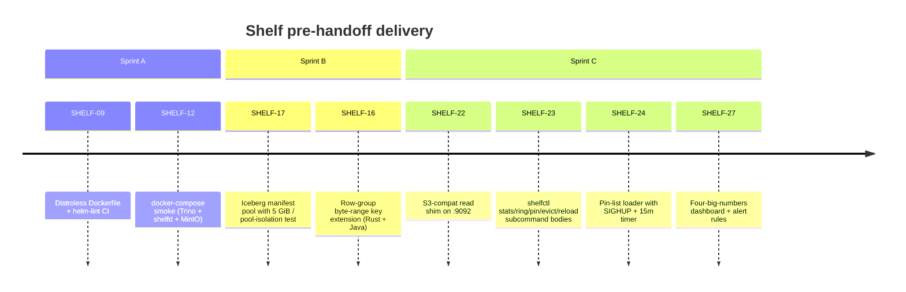

# Shelf — Cluster handoff packet

This is the "what's left for ops" packet after the local code push closed
every ticket that doesn't need a real Kubernetes cluster. Sprints A / B / C
landed the following on `main`:

Bookkeeping commits (SHELF-01/04/11) and the Phase-0 / Phase-1 foundation
landed in earlier sprints. What remains is **six tickets that cannot be
completed without a live 3-pod StatefulSet on EKS** — ops owns those.

## The six cluster-gated tickets

| Ticket | What it asserts | Why it needs a cluster | Owner (suggested) |
|---|---|---|---|
| **SHELF-13** Shadow-traffic rollout on rep-2 | 5 % → 50 % → 100 % shadow mirror via Trino Gateway; no incidents for 72 h at 100 % | Requires Trino Gateway config, replica-2-canary resource group, rep-2 query traffic | trino-platform + sre-1 |
| **SHELF-14** Experiments E1, E3, E10, E12 | Cold miss-mix, warm re-run, pod rotation mid-query, mixed Trino / DuckDB traffic | Needs SHELF-13 rollout to have real shadow traffic; experiment scripts live in `benchmarks/` but harness is cluster-bound | rust-engineer-1 + sre-1 |
| **SHELF-18** NVMe hybrid tier (accept half) | 500 GiB PVC, S3-FIFO eviction, data survives pod restart | Acceptance "survives pod restart" requires StatefulSet + PVC; Foyer hybrid-mode wiring can land locally but the runtime proof needs a cluster | rust-engineer-2 + k8s-eng-1 |
| **SHELF-20** Pod-rotation conformance (E7 only) | < 1 % mis-routed requests during a rolling restart | Java side + `/stats` contract landed in earlier sprint; the 1 %-mis-route measurement needs a 3-pod rolling restart on real traffic | trino-plugin-eng-1 + sre-1 |
| **SHELF-21** 3-pod StatefulSet rollout | Helm upgrade rehearsal, anti-affinity across AZs, NVMe PVC mount semantics | `charts/shelf/` renders fine under `helm lint` + `helm template`, but the rollout happens on the cluster | k8s-eng-1 |
| **SHELF-28** Chaos drills + v0.5 gate runbook | Pod-kill / disk-fill / network-partition drills under load; runbook battle-tested | Drills are by definition cluster-level | sre-1 |

## v0.5 gate (blocks `v0.5` tag)

The v0.5 gate is a **7-day production observation window** after
SHELF-13 / 14 / 21 / 27 / 28 are all green. Observation window metrics
are the four big-number panels on the SHELF-27 dashboard (shipped at
`charts/shelf/grafana/dashboards/shelf-read-path.json`) plus the alert
rules at `charts/shelf/grafana/alerts/shelf-read-path.yml`.

Green criteria:
- **Hit-ratio ≥ 80 %** weekly p50 on the overall panel (per-pool can
  dip for specific workload mixes).
- **p99 read latency ≤ 100 ms** at steady state — the
  `ShelfReadPathP99Degraded` alert must not fire.
- **5xx rate ≤ 1 %** — `ShelfReadPathHighErrorRate` must not fire.
- **Hit-ratio must not collapse** — `ShelfReadPathHitRatioCollapsed` is
  informational; one firing inside the 7-day window is fine, two in a
  row suggests a deeper problem.

## Pointers for the ops takeover

- **Runbook seeds** — `shelf/docs/oncall.md`, `shelf/docs/SLO.md`,
  `shelf/docs/capacity.md` all have bootstrap content already. SHELF-28
  extends them; don't rewrite them.
- **Helm chart** — `charts/shelf/` with `values-dev.yaml` and
  `values.yaml`. `helm lint charts/shelf` is green in CI via
  `.github/workflows/helm-lint.yml`.
- **Docker image** — `shelfd/Dockerfile` produces a distroless image
  ≤ 80 MB compressed. Build in CI via the `helm-lint` workflow; promote
  via whatever registry path ops uses.
- **Observability** — the dashboard ConfigMap is gated on
  `values.grafana.enabled = true`. Alert rules are raw Prometheus YAML
  at `charts/shelf/grafana/alerts/` — wire into the Prometheus
  operator's `PrometheusRule` CRD or drop into the alerting stack
  ops already runs.
- **Pin list** — `s3://<config-bucket>/shelf/pin_list.json`. Schema
  and reload semantics documented in
  `shelfd/docs/design-notes/SHELF-23-24-admin-surface-and-pinlist.md`.
  Initial list can be empty (`{"version":1,"entries":[]}`); fill it
  after SHELF-26 replay data identifies the hot keys.
- **S3-compat shim** — port `:9092` on every pod. boto3/DuckDB/Polars
  access path in `shelfd/docs/design-notes/SHELF-22-s3-compat-shim.md`.
  No auth today; expose behind the same network policy as `:8080`.
- **shelfctl** — `cargo build -p shelfctl --release` produces the
  operator CLI. Subcommands: `stats`, `ring`, `pin`, `unpin`, `evict`,
  `reload`. All talk to `/admin/*` over HTTP (default endpoint
  `http://127.0.0.1:8080`). Packaging via the same distroless-adjacent
  image or a separate `shelfctl` image — ops call.

## What is NOT in scope for this handoff

- Footer TCompactProtocol parser — tracked as **SHELF-16b**. Local
  follow-up, not cluster-gated. Can land whenever a Java engineer has
  time for the Thrift parse; wire-format is frozen.
- FrozenHot eviction policy — tracked as **SHELF-17a**. SIEVE ships
  today. Re-evaluate after SHELF-26 replay data shows whether
  manifest hot-set thrash is a real concern.
- Unified PR CI rail — tracked as **SHELF-01a**. bench + security +
  helm-lint rails are green; `fmt + clippy + test + mvn verify +
  docker build` as a single PR workflow is the remainder. Local
  follow-up, low priority.

## Cross-references

- Full plan: `agents/out/03-plan.md`
- Blueprint: `BLUEPRINT.md`
- ADRs: `agents/out/adr/`
- Design notes per ticket: `shelfd/docs/design-notes/SHELF-*.md` and
  `clients/trino/docs/design-notes/SHELF-*.md`
