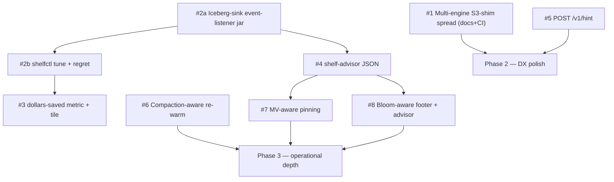

# Shelf — feature ideas ranked (OSS-clean, scientifically scrubbed)

## Methodology

Five parallel research passes (Cluster A: Iceberg metadata primitives; Cluster B: catalog mirror + companions; Cluster C: operator/DX tools; Cluster D: FinOps + multi-tenancy; Cluster E: multi-engine + AI/ML) verified each candidate feature against current upstream code, GitHub issues/PRs, and OSS comparables as of 2026-04-28. Every internal-only anchor was replaced with a generic OSS reference (the public `io.trino.spi.eventlistener.QueryCompletedEvent` SPI, public Trino issue numbers, public Iceberg PRs). Each feature received a verdict: KEEP / DOWNGRADE / DROP.

Score: V (adoption-driving value 1–5) + C (novelty / tweet-factor 1–5). Tiebreak on V. Source-cluster cited as `[A.n]`, `[B.n]`, `[C.n]`, `[D.n]`, `[E.n]`.

## Tier S — must build (Total 9–10)

### 1. Multi-engine S3-shim spread — Spark / DuckDB / Polars / Daft / ClickHouse / StarRocks / PyIceberg [E.1] (V5 C4)

- **Problem.** Shelf's signature-agnostic S3 shim already accelerates *any* engine that takes an `s3.endpoint`, but no docs / CI matrix / demo says so. Each engine has a documented OSS path to a non-AWS endpoint with disabled-or-relaxed signing: Spark via `spark.hadoop.fs.s3a.endpoint` + `spark.hadoop.fs.s3a.path.style.access=true` ([Hadoop S3A docs](https://hadoop.apache.org/docs/stable/hadoop-aws/tools/hadoop-aws/index.html)); DuckDB via `SET s3_endpoint=`, `SET s3_url_style='path'` ([DuckDB httpfs docs](https://duckdb.org/docs/extensions/httpfs/s3api.html)); Polars / Daft / iceberg-rust via `object_store::aws::AmazonS3Builder::with_endpoint` ([crate docs](https://docs.rs/object_store/latest/object_store/aws/struct.AmazonS3Builder.html)); ClickHouse via `<endpoint>` in `<storage_configuration>` ([CH docs](https://clickhouse.com/docs/integrations/s3)); StarRocks via `aws.s3.endpoint` storage volume ([SR docs](https://docs.starrocks.io/docs/sql-reference/sql-statements/cluster-management/storage_volume/CREATE_STORAGE_VOLUME/)); PyIceberg via `s3.endpoint` in catalog properties ([PyIceberg config](https://py.iceberg.apache.org/configuration/)).
- **Solution.** Zero data-plane code. Ship `examples/{spark,duckdb,polars,daft,clickhouse,starrocks,pyiceberg}/` each with `docker-compose.yml` + 5-min readme, plus a CI matrix (`.github/workflows/multi-engine.yml`) that runs them every PR. One-line section in the v1 launch blog: "the same binary, six engines, free."
- **Feasibility.** All 7 engines verified compatible with non-AWS endpoint + path-style. Path-style is the only universal extra knob.
- **Effort.** S. **Risk.** Low — no new code, only docs + CI.
- **Verdict.** **KEEP — top OSS-launch headline.**

### 2. `shelfctl tune` + `shelfctl regret` (anti-bragging) [C.2 + C.1] (V5 C4)

- **Problem.** New users don't know if Shelf is helping them, what to pin, or how to size pools — this is the #1 reason teams stay on direct S3 even after install. And no OSS infra project today proactively surfaces *where it made things worse* — users find out via incidents. Trino itself doesn't ship an Iceberg-sink event-listener (only `mysql`, `kafka`, `http`-style sinks per `io.trino.plugin.eventlistener.`*).
- **Solution.** Ship a Shelf-maintained **Iceberg-sink event-listener jar** (drops into `plugin/event-listener-shelf-iceberg/`) that consumes `io.trino.spi.eventlistener.QueryCompletedEvent` and writes to a generic Iceberg table whose schema is in our repo; this is the missing OSS piece that funds tune+regret+A/B+explain in one shot. Then `shelfctl tune --window 7d` reads that table + Shelf metrics and prints a one-page ROI report ($-saved, hit-ratio per table, top-10 pin candidates, recommended pool sizing) plus a `values.yaml` patch. `shelfctl regret --window 24h` lists tables/queries where p95 was *worse* through Shelf vs direct S3, with the reason (rate-limited / evicted / origin-pool-exhausted).
- **Feasibility.** `QueryCompletedEvent` exposes `QueryStatistics.physicalInputBytes`, `wallTime`, `cpuTime`, `getOperatorSummaries()` (per-operator I/O including the `bytesReadFromCache` / `bytesReadExternally` from [trinodb/trino #26342](https://github.com/trinodb/trino/issues/26342)). Public SPI, stable since Trino 350.
- **Effort.** M (the jar + the two CLIs). **Risk.** Low.
- **Verdict.** **KEEP — funds C.1 / C.2 / C.4-tag / C.5 simultaneously, build first.**

### 3. `shelf_s3_dollars_saved_total{tenant,table,user}` + Tailscale-style public savings tile [D.2] (V4 C4)

- **Problem.** Procurement decks ask "what does this thing save us?" and Alluxio / JuiceFS / Mountpoint / Iceberg's own caches can't answer in dollars-per-Iceberg-table. OpenCost and Karpenter's cost reporter compute *cluster* cost; Cloudflare R2 analytics shows R2 GET savings; nobody computes per-Iceberg-table $-saved.
- **Solution.** Audit-able formula, fail-closed against over-claim:
  ```
  shelf_$_saved =
        (hits_bytes / 1 GB)                × $0.0004           # S3 GET request data
      + (hits_count / 1000)                × $0.0004           # S3 GET request count
      + (hits_bytes_via_NAT / 1 GB)        × $0.045            # NAT egress (0 unless flagged on)
      + (hits_bytes_cross_az / 1 GB)       × $0.01             # cross-AZ data transfer
      − amortized_shelf_$cost_per_window                       # MUST subtract
  ```
  `frac_traffic_through_NAT` and `frac_traffic_cross_az` default to 0 — the tile refuses to publish a savings number unless the operator has explicitly enabled them with cluster-specific values. Public tile is a static SPA at `/savings` reading the same `/stats` JSON, signed read-only.
- **Feasibility.** AWS pricing pages cited; subtraction line is mandatory in the implementation.
- **Effort.** S–M. **Risk.** Over-claim if formula skips amortized cost — the formula refuses to publish without it.
- **Verdict.** **KEEP — buyer-facing money story Alluxio/JuiceFS/Mountpoint don't ship.**

### 4. `shelf-advisor` companion — JSON recommendations (no MR opener) [D.1] (V5 C3)

- **Problem.** Trino has no native loop that emits "this table needs `OPTIMIZE`," "add a bloom filter on this column," "this MV is hotter than its base scan." Pinterest's STG211 talk ([re:Invent 2025](https://dev.to/kazuya_dev/aws-reinvent-2025-scaling-pinterest-iceberg-solutions-for-petabyte-scale-challenges-stg211-53i6)) and the [RisingWave small-file blog](https://risingwave.com/blog/iceberg-small-file-problem/) document the homegrown pipelines every shop builds. Iceberg #9674 (small files) and Trino #28636 still open.
- **Solution.** Standalone Rust binary that mines `QueryStatistics.getOperatorSummaries()` from the Iceberg-sink log table (#2) + Iceberg manifests, emits a JSON document per recommendation (`bloom_filter_columns`, `optimize_targets`, `mv_candidates`, confidence 0–1). **Does NOT ship an MR opener** — leave that to the user's own GitHub Action / GitLab CI / Bytebase workflow. Cuts Shelf scope by ~70%, defers the auth/IDP nightmare.
- **Feasibility.** All inputs from public SPIs; recommendation output is engine-agnostic JSON.
- **Effort.** M. **Risk.** False-positive flood — gate by per-table top-N + ops review on the user side.
- **Verdict.** **KEEP — JSON-only, no MR opener in v1.**

### 5. `POST /v1/hint` engine-agnostic plan-hint federation [B.5] (V4 C4)

- **Problem.** Spark and Trino each build their own pre-fetch path; Shelf's existing `ShelfPrefetchListener` is Trino-only via `EventListener` SPI. No upstream protocol exists for "engine-X tells the cache to prepare these manifests." Trino #29184 (blob-cache SPI) is the long-tail upstream answer; until then, a thin REST surface unblocks every other engine.
- **Solution.** REST endpoint accepting `{snapshot_id, manifest_paths[], data_file_paths[], priority}` that schedules prefetch via the existing `Prefetch` machinery. Pluginlets in Spark / DuckDB / Polars all POST to the same wire. Stays a *hint* — fail-open, no engine waits on it.
- **Feasibility.** Pure additive, no SPI gap on Shelf side. Engine-side adapters are post-v1 — REST surface alone is enough to claim the niche.
- **Effort.** S (REST surface only). **Risk.** Low.
- **Verdict.** **KEEP — genuinely novel, no upstream blocker, ship REST first.**

### 6. Compaction-aware re-warm [A.3] (V4 C3)

- **Problem.** Every shop with nightly `EXECUTE optimize` / `expire_snapshots` eats a 100% miss morning. The cache was warmed for *yesterday's* files; today's `Snapshot.summary["operation"]="replace"` rewrites every path with a new ETag, and content-addressed keys correctly invalidate but leave the cache cold. Apache Iceberg [Maintenance docs](https://iceberg.apache.org/docs/latest/maintenance) describe the lifecycle; [Alex Merced's metadata-bloat post (Jul 2025)](https://iceberglakehouse.com/posts/iceberg-metadata-bloat-cleanup/) shows operational impact. Mountpoint-S3 issue [#631](https://github.com/awslabs/mountpoint-s3/issues/631) ("scripted prefetch") still open.
- **Solution.** A `compaction-watcher` reactor (in `shelfd` or sidecar) subscribes to snapshot transitions, detects `summary["operation"]="replace"`, diffs `removed_data_files` vs `added_data_files` from the manifest list, cross-references against the live pin-list, and fires `Prefetch(new_file, FOOTER+PAGE_INDEX)` for matched replacements. KB-scale work, dirt cheap. Optionally re-warm row groups whose `lower_bounds`/`upper_bounds` cover the same predicate as the most recent N hits against the old file.
- **Feasibility.** Zero new SPI; rides on already-public Iceberg metadata. Snapshot-watcher is already in v1 plan.
- **Effort.** M. **Risk.** Thundering-herd against S3 — gate by per-prefix RL (already in BLUEPRINT §9.4) and cap per-snapshot re-warm bytes.
- **Verdict.** **KEEP — closes a real OSS gap (Alluxio EE only invalidates).**

### 7. Materialized-view-aware pinning [A.5] (V3 C4)

- **Problem.** Iceberg MV refresh is base-table-heavy; bounded by S3 GET throughput on cold cache. Trino issue [#24734](https://github.com/trinodb/trino/issues/24734) and PR [#26149](https://github.com/trinodb/trino/pull/26149) (backport into 474, Jan 2025) document MV freshness retrieval was serial across N base tables; Iceberg PR [#14440](https://github.com/apache/iceberg/pull/14440) lands a dual `expire-after-access`/`expire-after-write` cache policy *because* MV/streaming kept hot tables forever.
- **Solution.** `shelf-advisor` parses Trino MV definitions stored as Iceberg metadata-table properties (`trino.materialized-view.storage-table`, `trino.materialized-view.fresh-snapshot-id`) and emits pin-list entries `{ table, partition_filter: <MV_predicate>, ttl: until_next_MV_refresh + 1h }`. shelfd's `Pin` RPC already exists. Trigger via `ConnectorMetadata.getMaterializedViewFreshness()` (Trino 416+ public SPI). Total bytes capped at `nvme_quota * pin_fraction` (default 0.3).
- **Feasibility.** All artefacts public. iceberg-rust does not yet parse MV definitions — advisor parses metadata.json directly.
- **Effort.** M. **Risk.** Multi-TB base-partition blanket-pin — hard cap on pin-set bytes is mandatory.
- **Verdict.** **KEEP — already Phase 9, no scope expansion needed.**

### 8. Bloom-aware footer cache + advisor [A.8] (V4 C3)

- **Problem.** Parquet bloom filters are NOT in the trailing-64-KB footer — each lives at an arbitrary `bloom_filter_offset` in the file ([Parquet spec](https://parquet.apache.org/docs/file-format/bloomfilter/), [DuckDB Parquet bloom blog Mar 2025](https://duckdb.org/2025/03/07/parquet-bloom-filters-in-duckdb.html)). A naive "cache the trailing footer" misses bloom payloads entirely. Trino landed bloom-write in PR [#20662](https://github.com/trinodb/trino/pull/20662) (445, Apr 2024); reads them on predicate pushdown. Iceberg PR [#15311](https://github.com/apache/iceberg/pull/15311) explores Puffin-backed bloom, orthogonal direction. **No OSS cache caches the bloom payload separately today.**
- **Solution.** Two coupled additions:
  - **Bloom-extended footer admission** — when shelfd parses an admitted Parquet footer, walk `column_metadata.bloom_filter_offset` for each column; for non-null offsets, fire a follow-up range-GET for the bloom block (typically 2–32 KiB/column), admit under metadata pool keyed by `(etag, offset, length, "bloom")`, size-capped per column (default 1 MiB).
  - **Advisor extension** — nightly job mines the event-listener log table for `WHERE col = literal` patterns, computes `equality_selectivity × frequency × wall_time`, recommends top-N columns per table for `write.parquet.bloom-filter-enabled.column.<col>=true`. Recommendation is JSON; ops review the writer-side change.
- **Feasibility.** Mechanical inside shelfd; no new SPI. Trino's bloom reader fetches via the same FS shim and gets a hit.
- **Effort.** S (admission) + M (advisor). **Risk.** Cardinality blow-up if every column gets bloom — top-N gate.
- **Verdict.** **KEEP — closes a real hole in `pool.footer` design.**

## Tier A — high-leverage (Total 8)

### 9. `shelfctl chaos` — kill X% of pods mid-bench [C.3] (V3 C5)

- **Problem.** "Fail-open under churn" is an invariant, but every adopter still nervously asks "what if a pod dies mid-query?" There's no *demo* of it. LitmusChaos and Chaos Mesh are the OSS comparables but require their own install.
- **Solution.** `shelfctl chaos --kill 50%` randomly evicts shelfd pods via kubectl-go-client while a load-gen runs; produces a 30-second GIF showing zero query failures, 5–8 s of degraded p99, full recovery. Tailscale-grade weird-flex.
- **Effort.** S. **Risk.** None (dev/stage only).
- **Verdict.** **KEEP — small launch deliverable.**

### 10. Public status page (Tailscale-style) [C.6] (V3 C4)

- **Problem.** Internal Grafana is gated; nobody outside the team can see Shelf is up. Adopters want a 1-URL "is your cache healthy?" link to put in postmortems. [Tailscale's share-link pattern](https://tailscale.com/blog/share-data-securely-with-share-link/) is the comparable.
- **Solution.** Same `/stats` JSON, signed read-only, served as a static SPA at `https://shelf.<org>/`. Same UI as `/ui` but anonymized + no admin actions.
- **Effort.** S. **Risk.** Low.
- **Verdict.** **KEEP.**

### 11. `docker compose up` 5-minute demo with dbt [C.7] (V3 C3)

- **Problem.** First-touch experience for Shelf is ~30 min of helm + Trino + IRSA before anything works. DuckDB sets the OSS bar at 5 min from clone to query.
- **Solution.** `docker compose up` brings up MinIO + Trino + Shelf + a sample dbt project; one command runs `dbt run` twice and prints `cold: 47s, warm: 4s, $-saved: $0.31`. Single-screen aha moment.
- **Effort.** S. **Risk.** None.
- **Verdict.** **KEEP.**

### 12. Per-tenant priority lanes — token-bucket on origin pool [D.3] (V4 C3)

- **Problem.** Backfill ETL nukes BI dashboard latency every morning. [Trino resource-groups docs](https://trino.io/docs/current/admin/resource-groups.html) provide memory/CPU fairness only — no I/O fairness on shared origin connections.
- **Solution.** Two-phase. **Phase 1**: pool-level token bucket (Bucket4j-style, in shelfd) on the origin S3 pool — global rate divided across pools. **Phase 2** (after `query_id` is plumbed through the shim via the event-listener jar #2): per-(pool, tenant) bucket; BI tenants `weight=10`, ETL tenants `weight=1`. Native `ConnectorIdentity.extraCredentials` propagation lights up only after [trinodb/trino #29184](https://github.com/trinodb/trino/issues/29184) (blob-cache SPI) lands.
- **Effort.** S (Phase 1) + M (Phase 2). **Risk.** Tenant-label spoofing — must be source-authenticated, not just header-trusted.
- **Verdict.** **KEEP — two-phase ship.**

### 13. `shelfctl bundle` — debug dump [C.8] (V3 C2)

- **Problem.** When something goes wrong, support asks for kubectl logs + Grafana screenshots + helm values + Foyer state across N pods. 30 minutes lost per incident. [OpenShift `must-gather](https://docs.openshift.com/container-platform/latest/support/gathering-cluster-data.html)` is the OSS comparable.
- **Solution.** One command, single tar.gz with all of the above + redaction (strips IRSA ARNs, S3 credentials, IPs).
- **Effort.** S. **Risk.** Accidental secret leak — redaction list must be conservative, opt-in for full bundle.
- **Verdict.** **KEEP.**

### 14. `curl … | sh` zero-config install [C.9] (V3 C2)

- **Problem.** Helm + values.yaml is too much for a first-touch demo. ClickHouse and Bun set the OSS bar at one line.
- **Solution.** `curl https://shelf-project.dev/install.sh | sh` installs `shelfctl`, runs `shelfctl install --kube-context=…` which generates values.yaml from the cluster's catalogs, runs Helm, returns the URL.
- **Effort.** M (install.sh + auto-detect). **Risk.** Cluster-detection mistakes — must show the generated values.yaml and prompt before applying.
- **Verdict.** **KEEP.**

## Tier B — downgraded but still ships (Total 5–6)

### 15. A/B query tagging in event listener (NOT runtime coin-flip) [C.4] (V3 C2)

- **Why downgraded.** Original idea was "in-plugin per-query A/B coin-flip." Verified against Trino 480: `TrinoFileSystem.newInputFile(Location)` takes no `QueryId`, so a true *runtime* per-query toggle is **infeasible without an upstream SPI change**.
- **Shipped scope.** Tag the query in `EventListener.queryCreated` with `shelf_arm={A,B}` based on a deterministic hash of `query_id`; the event-listener jar (#2) records the tag. Cutover analysis becomes a SQL `GROUP BY shelf_arm` against the log table. Genuine A/B requires the catalog to be split (existing parallel `cdp_shelf` pattern); the tag just makes the analysis honest.
- **Verdict.** **KEEP downgraded.** Document the SPI gap, file an upstream TIP.

### 16. `shelfctl explain query <id>` CLI (NOT `EXPLAIN (TYPE SHELF)`) [C.5] (V3 C3)

- **Why downgraded.** Trino's EXPLAIN grammar hardcodes `LOGICAL`/`DISTRIBUTED`/`VALIDATE`/`IO`; `io.trino.spi.Plugin` has no extension hook for new EXPLAIN types.
- **Shipped scope.** `shelfctl explain query <id>` reads `QueryStatistics.getOperatorSummaries()` (per-query `bytesReadFromCache` / `bytesReadExternally` from [trinodb/trino #26342](https://github.com/trinodb/trino/issues/26342)) plus `getJsonPlan()`, renders the same UX post-hoc — file list with cache state per file (`HIT_DRAM | HIT_NVME | MISS | PREFETCH_QUEUED`), MB served, $-saved.
- **Verdict.** **KEEP downgraded as CLI.** File upstream TIP for engine-pluggable EXPLAIN.

### 17. Coalesced range-GET inside shelfd shim [A.6] (V2 C2)

- **Why downgraded.** Trino's native S3 client (`io.trino.filesystem.s3.S3InputFile`) doesn't do vectored reads — there's a niche, but [Hadoop S3A vectored I/O](https://issues.apache.org/jira/browse/HADOOP-18103) and [AAL](https://github.com/awslabs/analytics-accelerator-s3) (Apache 2.0) already do this well. Iceberg PR [#12299](https://github.com/apache/iceberg/pull/12299) integrates AAL.
- **Shipped scope.** Internal shelfd optimisation in `s3_shim::handle_get_object` — coalesce intra-file ranges with gap < 128 KiB, max-fill ratio 0.25. Consider **vendoring AAL** instead of re-rolling.
- **Verdict.** **KEEP downgraded as internal opt.**

### 18. Decoded metadata as in-process shelfd cache (NOT a network pool) [A.2] (V3 C2)

- **Why downgraded.** Original idea was three new network pools (`pool.footer`/`pool.manifest`/`pool.puffin`) serving pre-decoded blobs. Verified: **no Trino SPI lets a plugin hand a pre-parsed `ParquetMetaData` to the Iceberg reader**. `ParquetPageSourceFactory` always calls `MetadataReader.readFooter(TrinoInputFile)`. Same SPI gap as ADR-0012.
- **Shipped scope.** Internal `dashmap<key, Arc<ManifestFile>>` and `Arc<ParquetMetaData>` for shelfd's own prefetch worker. Accelerates Phase 2b sort-order awareness; not exposed externally.
- **Verdict.** **KEEP downgraded — internal-only.**

### 19. `MemoryFileSystemCache` cooperation = runbook line + startup banner [A.4] (V4 C1)

- **Why downgraded.** `io.trino.filesystem.memory.MemoryFileSystemCache` is package-private; no SPI for an external FS to coordinate. `iceberg.metadata-cache.enabled=false` at catalog level is the only viable lever.
- **Shipped scope.** One-line Helm values runbook entry + startup banner emitted by `ShelfFileSystemFactory` when it detects the property is unset.
- **Verdict.** **KEEP as docs/UX, not code.**

## DROPPED — verified upstream / infeasible / wrong layer


| #   | Idea                                    | Reason dropped                                                                                                                                  | Upstream / OSS evidence                                                                                                                                                                                                                                                                                                   |
| --- | --------------------------------------- | ----------------------------------------------------------------------------------------------------------------------------------------------- | ------------------------------------------------------------------------------------------------------------------------------------------------------------------------------------------------------------------------------------------------------------------------------------------------------------------------- |
| 20  | Cache-poisoning attestation [A.1]       | ETag content-addressing already gives integrity; "freshness-proof" needs Iceberg REST signing which is upstream-stalled.                        | [iceberg #14486](https://github.com/apache/iceberg/pull/14486) closed stale Dec 2025. **Fold** SHA-256-on-admission micro-fix into existing key path.                                                                                                                                                                     |
| 21  | Pre-aggregated `$partitions` blob [A.7] | No SPI for external delegation; engine-side fix in flight.                                                                                      | [trinodb/trino #26737](https://github.com/trinodb/trino/pull/26737) (distributed `$partitions`); [iceberg #13903](https://github.com/apache/iceberg/pull/13903) (LOCAL/DISTRIBUTED/AUTO modes).                                                                                                                           |
| 22  | Catalog mirror promotion [B.1]          | Polaris federation already covers REST→REST; HMS path has split-brain risk.                                                                     | [Polaris federation](https://polaris.apache.org/in-dev/unreleased/external-catalogs/) docs.                                                                                                                                                                                                                               |
| 23  | `shelfd-rest` vended-cred proxy [B.2]   | Iceberg REST OpenAPI doesn't list `s3.endpoint` as honored config; Trino support gated on unmerged PR.                                          | [iceberg open-api/rest-catalog-open-api.yaml](https://github.com/apache/iceberg/blob/main/open-api/rest-catalog-open-api.yaml); [trinodb/trino #27922](https://github.com/trinodb/trino/pull/27922) unmerged. **Cheaper:** configure upstream Lakekeeper / controlled Polaris to vend `s3.endpoint=shelfd:9092` directly. |
| 24  | `shelf-maintenance` companion [B.3]     | `SupportsBulkOperations` already in Iceberg core; Trino 403+ uses it.                                                                           | [trinodb/trino #14434](https://github.com/trinodb/trino/issues/14434) closed; `DeleteOrphanFilesSparkAction` PR [#6682](https://github.com/apache/iceberg/pull/6682).                                                                                                                                                     |
| 25  | Cross-AZ pin-list replication [B.4]     | < 1 MiB JSON; replicating it doesn't give cache-byte DR.                                                                                        | S3 CRR + a runbook line is the correct shape.                                                                                                                                                                                                                                                                             |
| 26  | Lance `pool.lance` [E.2]                | Lance ships its own `FileMetadataCache`; row groups eliminated in Lance 2.0+.                                                                   | [lancedb/lance #2647](https://github.com/lancedb/lance/issues/2647), [#3949](https://github.com/lancedb/lance/issues/3949). Existing rowgroup pool already caches Lance bytes.                                                                                                                                            |
| 27  | MLflow / W&B auto-pin [E.3]             | Neither API exposes Iceberg run-input lineage cleanly.                                                                                          | MLflow `DatasetSource` is whatever the user passed; W&B `used_artifacts()` only sees W&B artifacts. The trainer mining the event-listener log (#2) is the right path.                                                                                                                                                     |
| 28  | Confidence-gated auto-pin [E.4]         | Three documented failure modes (feedback loop, hot-pool blast radius, writer-side false positives); rollback cost = multi-hour cache rewarming. | Keep `shelf-advisor` (#4) recommending; humans merge the ConfigMap PR.                                                                                                                                                                                                                                                    |


## DO NOT BUILD — explicit rejections (≥ 2 lenses agreed)

In-`shelfd` query result cache (companion only), full-text / inverted indexes, new columnar format (Vortex/Lance own this), write-through filesystem, POSIX FUSE, RDMA / Arrow Flight (HTTP/2 already wins for our object sizes), embedded Raft, vector search index, LLM agent KV-cache (wrong layer), differential-privacy passthrough (wrong layer), S3 Express One Zone shim (no demand signal), Athena / Snowflake non-Iceberg interception (closed clients), Dremio (commercial overlap).

## Sequencing — recommended ship order




- **Week 0–2 (zero-code wedges + foundation):** #1 multi-engine docs+CI, plus the Iceberg-sink event-listener jar (#2a) — the latter blocks #2b/#3/#4/#15/#16, build first.
- **Week 2–6 (Tier-S code):** #2b `shelfctl tune` + `regret`; #3 dollars-saved; #4 advisor JSON; #5 `/v1/hint` REST.
- **v1.x (operational depth):** #6 compaction-aware re-warm; #7 MV-aware pinning; #8 bloom-aware footer + advisor.
- **v1.x DX polish:** #9–14.
- **Tier B (downgraded, ships when capacity allows):** #15–19.
- **Drops + DO NOT BUILD:** documented in BLUEPRINT §14 explicitly so future contributors don't re-propose them.

## Two upstream Trino TIPs to file alongside

1. **Engine-pluggable EXPLAIN extension** — unlocks #16 (`EXPLAIN (TYPE SHELF)`).
2. `**QueryId` propagation into `TrinoFileSystem.newInputFile(Location)`** — unlocks #15 (true runtime A/B coin-flip) and is generally useful for any cache plugin doing per-query routing.

Both should reference [trinodb/trino #29184](https://github.com/trinodb/trino/issues/29184) (blob-cache SPI) as the umbrella.