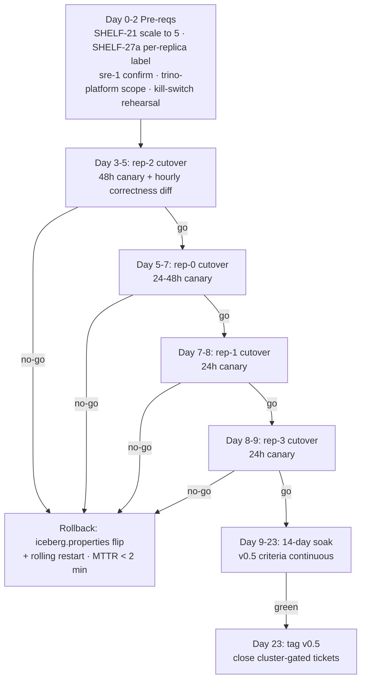

# Shelf v1 rollout runbook — Trino Iceberg, all four example replicas

> **Status**: pre-kickoff. This document is the single source of
> truth for the compressed-canary rollout that promotes Shelf from
> the rep-2 smoke-validated prototype to the production read path
> of all four example Trino replicas for the Iceberg catalog.
>
> **Owners**: shelf-core (runbook), sre-1 (workload inputs),
> k8s-eng-1 (StatefulSet apply), trino-platform (catalog config PRs).
>
> **Scope**: Trino 480 running in `trino-db` namespace, rep-0 /
> rep-1 / rep-2 / rep-3 replicas, Iceberg catalog only. Other
> catalogs (Hive, MySQL, PostgreSQL, etc.) untouched — see
> [`rollout-v1/trino-platform-scope-check.md`](rollout-v1/trino-platform-scope-check.md).

## TL;DR

Phase-1 wiring (Trino catalog `s3.endpoint=http://shelfd:9092`) is
smoke-validated with a 94 % warm hit ratio on 10 Iceberg queries.
We roll it out to all four replicas on a **per-replica 24-48 h
canary** rather than the originally-planned 7-day v0.5 gate
(decision: aggressive, accepts some blast-radius for faster
delivery). Each replica flips one-at-a-time in the order
**rep-2 → rep-0 → rep-1 → rep-3**. The 14-day post-rollout soak
recovers the slow-pathology signal the 7-day gate would have
caught.

Target timeline (no rollbacks): **Day 0-2 pre-reqs · Day 3-9 cutovers
· Day 9-23 soak · Day 23 v0.5 promotion**.

## Current state (what's already done)

- **Code + smoke**: Phase-1 wiring smoke-validates at 94 % warm hit
  ratio on 10 Iceberg queries (see
  [`benchmarks/smoke/`](../benchmarks/smoke)). ADR 0012 documents
  the wiring decision.
- **Observability**: dashboard JSON + alert rules shipped in CI
  under [`charts/shelf/grafana/`](../charts/shelf/grafana), with
  the **replica** template variable + `by (replica)` alert grouping
  landed today. The plumbing that makes the `replica` label appear
  on shelfd metrics is documented in
  [`shelfd/docs/design-notes/SHELF-27a-per-replica-label.md`](../shelfd/docs/design-notes/SHELF-27a-per-replica-label.md).
- **Capacity plan**: [`docs/capacity.md`](capacity.md) §4 holds the
  4-replica worked example; `values-prod.yaml` is already sized
  at `replicaCount: 5`.
- **Correctness harness**: [`benchmarks/correctness-diff/`](../benchmarks/correctness-diff)
  ships 5 canonical queries + a row-hashed diff runner + a CronJob
  template. Unit tests green.
- **Pre-warm script**: `make prewarm REPLICA=... TRACE=...` in
  [`benchmarks/trino_logs/Makefile`](../benchmarks/trino_logs/Makefile)
  wraps the existing SHELF-26 replay binary.
- **Kill-switch runbook**: [`docs/runbook.md`](runbook.md) §kill-switch
  is complete and was chaos-tested in smoke (SHELF-28 local half).

## Rollout shape at a glance



Replica order rationale: **rep-2 first** because SHELF-13's smoke
work already primed it (all smoke traffic ran via the rep-2 pool
seed). **rep-0/1/3 then in smallest-workload-first order** once
sre-1 confirms per-replica `monthly_reads` — provisional order is
rep-0 → rep-1 → rep-3, finalised at the `sre-1` pre-req close.

## Pre-requisites (non-negotiable — must land before rep-2 cutover)


| Pre-req                       | Owner         | Status     | Artifact                                                                             |
| ----------------------------- | ------------- | ---------- | ------------------------------------------------------------------------------------ |
| SHELF-21 StatefulSet → 5 pods | k8s-eng-1     | pending    | [§6 below](#6-shelf-21-stateful-set-scale-up)                                        |
| SHELF-27a per-replica label   | shelf-core    | designed   | [shelfd/docs/design-notes/SHELF-27a-per-replica-label.md](../shelfd/docs/design-notes/SHELF-27a-per-replica-label.md) |
| Capacity resize doc           | shelf-core    | complete   | [`docs/capacity.md`](capacity.md) §4                                                 |
| Dashboard + alerts replica-cut| shelf-core    | complete   | [`charts/shelf/grafana/`](../charts/shelf/grafana)                                   |
| Correctness diff harness      | shelf-core    | complete   | [`benchmarks/correctness-diff/`](../benchmarks/correctness-diff)                     |
| Pre-warm script               | shelf-core    | complete   | `make prewarm` in [`benchmarks/trino_logs/Makefile`](../benchmarks/trino_logs/Makefile) |
| Per-replica `monthly_reads`   | sre-1         | pending    | [§7 below](#7-sre-1-workload-confirmation) + [question packet](rollout-v1/sre1-workload-confirm.md) |
| Trino scope check             | trino-platform| pending    | [§8 below](#8-trino-platform-scope-check) + [question packet](rollout-v1/trino-platform-scope-check.md) |
| Kill-switch rehearsal         | shelf-oncall  | pending    | [§9 below](#9-kill-switch-rehearsal) + [rehearsal plan](rollout-v1/killswitch-rehearsal.md) |

## 6. SHELF-21 StatefulSet scale-up

### Current state

The chart renders cleanly:

```bash
helm template shelf-prod charts/shelf -f charts/shelf/values-prod.yaml \
  --kube-version 1.29.0 > /tmp/shelf-prod.yaml
grep -E '^(kind:|  name:|  replicas:|            storage:)' /tmp/shelf-prod.yaml
# → StatefulSet shelf-prod, replicas: 5, storage: 500Gi
```

Cross-checked fields: `replicas=5`, `storage.size=500Gi`,
`nodeSelector.workload=shelf`, hostname anti-affinity required +
zone anti-affinity preferred, PDB `maxUnavailable=1`,
`priorityClass=shelf-data-plane`, ServiceMonitor on, NetworkPolicy
on.

### Apply procedure (k8s-eng-1, Day 0)

1. **Inspect the current StatefulSet state**:
   ```bash
   kubectl -n shelf get statefulset shelf-prod -o jsonpath='{.spec.replicas}' 2>/dev/null
   # 3 pods (v0.5 smoke state) → scaling +2
   # 0 or "not found" → fresh install, no smoke-state to preserve
   ```
2. **Diff against the rendered chart** to verify only
   `replicaCount`, `affinity`, and Grafana ConfigMap bytes change:
   ```bash
   helm diff upgrade shelf-prod charts/shelf \
     -f charts/shelf/values-prod.yaml \
     -n shelf --allow-unreleased
   ```
   Acceptable diffs: replica count delta; PVC list grows by 2;
   Grafana ConfigMap hash change (replica-label cut landed today).
   Any other diff — escalate to shelf-core before applying.
3. **Apply**:
   ```bash
   helm upgrade --install shelf-prod charts/shelf \
     -f charts/shelf/values-prod.yaml \
     -n shelf --create-namespace
   ```
4. **Watch the scale-up**:
   ```bash
   kubectl -n shelf rollout status statefulset/shelf-prod --timeout=15m
   ```
   `OrderedReady` pod management + `maxUnavailable=1` PDB means
   this serialises pod-by-pod, ~90 s per pod, ~7-8 min for the
   2-pod delta. If a pod stays `Pending` > 2 min, check
   `kubectl -n shelf describe pod` for NVMe PVC binding issues —
   a constrained local-nvme StorageClass is the most likely
   blocker (escalate to karpenter-pool-owner).
5. **Confirm healthy**:
   ```bash
   kubectl -n shelf get pod -l app.kubernetes.io/name=shelf
   # 5/5 Running, all Ready
   kubectl -n shelf exec shelf-prod-0 -- curl -sf localhost:9091/metrics | \
     head -20
   # shelf_request_seconds_count present; readyz returns 200
   ```
6. **Confirm anti-affinity spread**:
   ```bash
   kubectl -n shelf get pod -l app.kubernetes.io/name=shelf \
     -o jsonpath='{range .items[*]}{.metadata.name}{"\t"}{.spec.nodeName}{"\n"}{end}'
   # 5 distinct nodes expected (hostname anti-affinity: required)
   ```

### Failure / rollback

- **Pod stuck Pending**: `kubectl -n shelf rollout undo
  statefulset/shelf-prod`. Rollback target = whatever revision
  Helm had before the upgrade.
- **Pod CrashLoopBackOff**: `kubectl logs`; likely image digest
  mismatch or bad env. Rollout runbook §kill-switch still applies.
- **PVC never binds**: escalate; StorageClass `local-nvme` is
  operator-gated, can't be self-serviced.

This scale-up is the **only** destructive change during pre-reqs.
Everything else (dashboard / alerts / correctness harness / pre-
warm) is read-only or container-level and reversible via image
redeploy.

## 7. sre-1 workload confirmation

The capacity plan in `docs/capacity.md` §4 extrapolates rep-2's
900 TiB/month to 3.6 PiB/month across four replicas using a 4×
multiplier. sre-1 must replace this with measured per-replica
`monthly_reads` + working-set breakdown from
`QueryCompletedEvent` before any cutover.

→ **Question packet**: [`rollout-v1/sre1-workload-confirm.md`](rollout-v1/sre1-workload-confirm.md).

Blocker on: rep-2 cutover T-24h.

## 8. Trino-platform scope check

The cutover PRs flip each replica's `iceberg.properties` to point
at `shelfd:9092`. If any **non-Iceberg** catalog in the `trino-db`
namespace shares that S3 endpoint config — unlikely but possible
if someone wired a Hive catalog at the same bucket — our PR would
accidentally redirect it. trino-platform needs to confirm the
blast radius is exactly "Iceberg catalog, four replicas, zero
other catalogs".

→ **Question packet**: [`rollout-v1/trino-platform-scope-check.md`](rollout-v1/trino-platform-scope-check.md).

Blocker on: rep-2 cutover T-24h.

## 9. Kill-switch rehearsal

[`docs/runbook.md`](runbook.md) §kill-switch-tree defines the
rollback procedure. Before rep-2 actual cutover we execute it
once against rep-2 as a **dry run** (flip the rep-2
`iceberg.properties` endpoint back to direct S3 while rep-2 is
still the smoke pool — zero production impact because rep-2
isn't yet cut over) and measure MTTR end-to-end.

→ **Rehearsal plan**: [`rollout-v1/killswitch-rehearsal.md`](rollout-v1/killswitch-rehearsal.md).

Blocker on: rep-2 cutover T-1h.

## 10. Per-replica cutover

The four replicas cut over in sequence. Each uses the **generic
cutover procedure** below, plus per-replica specifics captured in:

- [`rollout-v1/cutover-rep2.md`](rollout-v1/cutover-rep2.md) (first; 48 h canary)
- [`rollout-v1/cutover-rep0.md`](rollout-v1/cutover-rep0.md) (second; 24-48 h)
- [`rollout-v1/cutover-rep1.md`](rollout-v1/cutover-rep1.md) (third; 24 h)
- [`rollout-v1/cutover-rep3.md`](rollout-v1/cutover-rep3.md) (last; 24 h)

### Generic cutover procedure

For each replica (`$R`), executed in strict order:

| Time  | Action                                                                               | Owner         |
| ----- | ------------------------------------------------------------------------------------ | ------------- |
| T-24h | `make prewarm REPLICA=$R TRACE=trino_logs/$R-last-7d.jsonl MANIFEST_DIR=...` (≥ 60 % hit-ratio floor, exit 0) | shelf-oncall  |
| T-1h  | Correctness diff baseline: run harness against `iceberg_direct` both sides, confirm byte-identical | shelf-oncall |
| T-0   | PR to `trino-db` manifests: flip `$R`'s `iceberg.properties` to `s3.endpoint=http://shelfd:9092`; roll `$R`'s Trino pods | trino-platform |
| T+2h  | **Checkpoint 1** — alert signals only (no fire on `ShelfReadPathHighErrorRate`, no fire on `ShelfReadPathP99Degraded` with `replica=$R`) | shelf-oncall  |
| T+12h | **Checkpoint 2** — full v0.5 criteria on rolling-12h window                          | shelf-oncall  |
| T+24h | **Checkpoint 3** — full v0.5 criteria on rolling-24h window + correctness diff zero-diff for 24 consecutive runs | shelf-oncall  |
| T+48h | **Promote-or-rollback** (rep-2 only; rep-0/1/3 checkpoint at T+24h) | shelf-core    |

### Go / no-go thresholds

Same as ADR 0010 v0.5 criteria, evaluated per-replica:

- Hit ratio ≥ 80 % (warm; after T+12h).
- p99 read latency ≤ 100 ms — `ShelfReadPathP99Degraded{replica=$R}` must not fire.
- 5xx rate ≤ 1 % — `ShelfReadPathHighErrorRate{replica=$R}` must not fire.
- `ShelfReadPathHitRatioCollapsed{replica=$R}` fires ≤ 1×.
- Correctness diff harness reports zero non-identity rows.

### Rollback (pre-committed, no debate)

Any alert fire during the first 48 h of any replica's canary, OR
any correctness diff fire, triggers **immediate rollback of that
replica**:

```bash
# The PR that flipped the endpoint is reverted; pods rolled.
kubectl -n trino-db rollout restart deployment/trino-$R
# MTTR: ≤ 2 min (measured in the kill-switch rehearsal).
```

## 11. Post-rollout soak (14 days, cumulative)

After rep-3 goes green we keep the v0.5 criteria under continuous
evaluation for **14 days** across the cumulative 4-replica traffic.
This is what the compressed canary gives up relative to the formal
v0.5 gate; we need the soak to catch slow-growing pathologies
(NVMe fragmentation, pinlist decay, working-set drift) the 24-48 h
canaries couldn't see.

→ **Soak tracker**: [`rollout-v1/soak-tracker.md`](rollout-v1/soak-tracker.md).

Pre-commitment: any v0.5 criterion failing for a 24 h window during
the soak → roll one replica back to S3-direct, root-cause, then
re-add. The specific replica to roll back is the one whose metrics
most strongly correlate with the degradation (per `replica=` panel).

## 12. v0.5 promotion

At the end of the 14-day soak (assuming green), tag `v0.5` and
close the cluster-gated tickets.

→ **Promotion procedure**: [`rollout-v1/v05-promote.md`](rollout-v1/v05-promote.md).

## 13. Risks (honest)

1. **24-48 h canary misses slow pathologies.** The v0.5 gate's 7
   days exists for a reason. Mitigation: the 14-day post-rollout
   soak with pre-committed roll-back. Residual risk: we might
   serve a degraded experience to some users for up to 48 h before
   rollback, where a 7-day gate would have caught it without any
   user impact.
2. **No shadow-mirror means no automatic correctness A/B.**
   Mitigation: the hourly correctness diff harness. Residual risk:
   anything *outside* the 5 canonical queries could diverge
   silently for up to an hour.
3. **Cold-start traffic spike.** Mitigation: pre-warm script.
   Residual risk: if a replica's `monthly_reads` is 2× our
   assumption, pre-warm under-sizes and the cold-start burst
   trips the p99 alert as a false positive during T+0 to T+30m.
4. **Capacity estimate extrapolates from rep-2.** Mitigation:
   sre-1 pre-req. Hard block on cutover T-24h.

## 14. Timeline (calendar, assuming no rollbacks)

| Day  | Work                                                              |
| ---- | ----------------------------------------------------------------- |
| 0    | SHELF-21 scale-up; SHELF-27a merge + deploy; sre-1 + trino-platform question packets sent |
| 1    | SHELF-27a Trino-side header PRs (one per replica); kill-switch rehearsal on rep-2 |
| 2    | Final dashboards showing per-replica signal; all pre-reqs closed  |
| 3-5  | rep-2 cutover + 48 h canary                                       |
| 5-7  | rep-0 cutover + 24-48 h canary                                    |
| 7-8  | rep-1 cutover + 24 h canary                                       |
| 8-9  | rep-3 cutover + 24 h canary                                       |
| 9-23 | 14-day soak                                                       |
| 23   | tag v0.5, close handoff                                           |

Any replica rollback adds ~3 days for root-cause + fix + re-canary
at the affected replica.

## 15. References

- [`docs/rollout-v1/cluster-handoff.md`](cluster-handoff.md) — prior state;
  lists the cluster-gated tickets this rollout closes.
- [`docs/capacity.md`](capacity.md) — sizing doc, v1-cluster
  worked example in §4.
- [`agents/out/adr/0010-v05-gate-beat-alluxio-on-rep2.md`](../agents/out/adr/0010-v05-gate-beat-alluxio-on-rep2.md)
  — the gate we're compressing.
- [`agents/out/adr/0012-trino-read-path-endpoint-swap-then-blob-cache-spi.md`](../agents/out/adr/0012-trino-read-path-endpoint-swap-then-blob-cache-spi.md)
  — the wiring mechanism this rollout is rolling out.
- [`docs/runbook.md`](runbook.md) — kill-switch tree invoked in
  rollbacks.
- [`charts/shelf/grafana/dashboards/shelf-read-path.json`](../charts/shelf/grafana/dashboards/shelf-read-path.json)
  — observability, with replica template variable.
- [`charts/shelf/grafana/alerts/shelf-read-path.yml`](../charts/shelf/grafana/alerts/shelf-read-path.yml)
  — alerts, grouped `by (replica)`.
- [`benchmarks/correctness-diff/`](../benchmarks/correctness-diff)
  — hourly correctness diff harness.
- [`benchmarks/trino_logs/Makefile`](../benchmarks/trino_logs/Makefile)
  — `make prewarm` target.
- [`shelfd/docs/design-notes/SHELF-27a-per-replica-label.md`](../shelfd/docs/design-notes/SHELF-27a-per-replica-label.md)
  — per-replica label plumbing.
