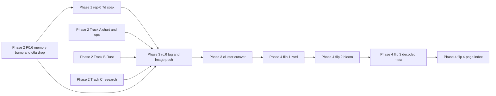

# rc.6 release plan (2026-04-30 IST)

Forward-looking release plan for `1.0.0-rc.6`. Scope: 5 P0 + 5 P1 items lifted from the rc.5 retrospective backlog (see [`./rc5-cutover-2026-04-30-exec-summary.md`](./rc5-cutover-2026-04-30-exec-summary.md) §3). Total target: ~2-3 weeks. Tag-and-cut sequence: rep-0 7-day soak → parallel prep tracks → image tag → progressive Tier-1 lever flips post-tag.

## 1. Scope (P0 + P1)

| ID   | Item                                                                                                | Class               | Effort                              |
| ---- | --------------------------------------------------------------------------------------------------- | ------------------- | ----------------------------------- |
| P0.1 | Helm chart `cost.region: ap-south-1` default in `infra/penpencil/charts/shelf/values-prod.yaml`     | chart               | < 1 day                             |
| P0.2 | PR #66 SHELF-37 listener jar — JDK 25 unblock or pin `trino-spi` to a JDK-17-compat release         | exogenous research  | 1-7 days                            |
| P0.3 | `Cargo.lock` regen for #49 SHELF-50 (deferred during the Apr 29-30 drain wave)                      | code                | < 1 day                             |
| P0.4 | Workspace-member `COPY` rule + Dockerfile tripwire (`cargo metadata` vs Dockerfile diff in CI)      | CI / Dockerfile     | < 1 day                             |
| P0.5 | `shelf-overview-v2` dashboard import (manual UI step OR mint a write-scoped Grafana SA)             | ops                 | < 1 day                             |
| P0.6 | Pod memory limit 32 → 40 GiB + Karpenter `alluxio` NodePool drop-c6a (PR #80, ADR-0027)             | infra/ops           | < 1 day (preflight) + 7 min cluster apply — **NEW Apr 30 EOD** |
| P1.1 | Tier-1 default-OFF lever flips × 4 (zstd / bloom / decoded-meta / page-index), each 24h A/B soak    | post-tag config     | 6-8 days sequential                 |
| P1.2 | Capacity-rule codification — admin endpoint refuses new replica traffic if any pod > 22 GiB RSS    | code                | 3-5 days                            |
| P1.3 | `/admin/pin` schema flexibility — accept the `gen_pin_list.py` replay-list shape                    | code                | 1-2 days                            |
| P1.4 | Per-pod RSS Grafana alert (24 GiB warn / 25.5 GiB critical) in `observability/alerts/shelf-prometheus-rules.yaml` | ops    | < 1 day                             |
| P1.5 | Foyer 0.22 bump (PR #22) — only if F2 gate clears (SHELF-35 replay shows ≥ 5 pp lift over S3-FIFO) | conditional         | 1 day if cleared; deferred otherwise|

## 2. Schedule

Four phases, two of them parallel inside.

### Phase 1 — rep-0 first-week soak (paused at +1.5 h)

**Status (EOD Apr 30): paused.** Phase D rolled back at hour 1.5 — `shelf-3` OOMKilled at 13:51:21 UTC, RSS peak 27.81 GiB on 32 GiB-limit pod, signature matches `c6a.4xlarge` allocatable. Revert MR `!17966` pushed but held open per user directive ("keep shelf there on rep0, low traffic at night time"); rep-0 stays on shelf through the low-traffic overnight window as standby. **Soak clock is paused** until the rc.6 P0.6 memory bump (32 → 40 GiB) and Karpenter NodePool drop-c6a both land — without the NodePool restriction, the 40 GiB bump reproduces today's OOM mode the next time a pod schedules onto a c6a node. Earliest rc.6 tag therefore moves to ~**May 8+** (slipped from May 7) to leave a clean 7-day soak window after the cluster fix lands. Daily checks on hit ratio, error class, and OOMKills resume once the soak clock restarts. ConfigMap and overlay edits during this window are fine; image churn is not.

### Phase 2 — rc.6 prep, parallel tracks (Apr 30 → May 4)

Three independent tracks, each a separate worker dispatch.

| Track | Items                          | Owner shape                                     | Notes                                                                                       |
| ----- | ------------------------------ | ----------------------------------------------- | ------------------------------------------------------------------------------------------- |
| A     | P0.1 + P0.4 + P0.5 + P1.4      | one worker, sequential, ~2-3 h wall-clock       | Chart + ops only; no toolchain, no Cargo.                                                   |
| B     | P0.3 + P1.2 + P1.3             | one worker sequential through three Rust tickets | Contiguous shelfd Rust changes; ADR + rollback table per workspace pattern.                 |
| C     | P0.2 + P1.5                    | two parallel research workers                   | P0.2 hunts a JDK-17-compat trino-spi pin; P1.5 watches SHELF-35 replay for the F2 gate.      |

### Phase 3 — rc.6 tag + cluster cutover (May 7 → May 10)

After Phase 1 + Phase 2 are clean:

1. Tag `v1.0.0-rc.6` on `main` after merging every Phase 2 PR.
2. Build + push to GitLab registry (`registry.gitlab.com/penpencil-services/data/data-engineering/ranger/shelfd:1.0.0-rc.6`); buildx `linux/amd64` only per workspace memory.
3. Cluster cutover via `kubectl set image` rolling restart on `sts/shelf` ns `alluxio` — ~7 min wall-clock for 6 pods, same shape as today's rc.4 → rc.5 rollout. Applies to `data-platform-cluster` only; rep-3 stays on direct S3.
4. 24h post-cutover soak with the same 7-trigger auto-rollback armed.

### Phase 4 — post-tag Tier-1 lever flips (May 10 → May 20)

Sequential per-flip, rep-1 as first canary. Each flip rides one per-replica overlay MR (per-replica field in `infra/penpencil/charts/shelf/values-prod.yaml`), one A/B tag (`X-Shelf-Tag: rc6-flip-N`), and a 24h soak. After 24h green: roll the same flip to rep-2, then rep-0 in the next session.

| Flip | Lever                              | First canary | Soak | Risk                                                                                |
| ---- | ---------------------------------- | ------------ | ---- | ----------------------------------------------------------------------------------- |
| #1   | SHELF-43 zstd compression          | rep-1        | 24h  | Low — config-only flip; revert via CM rewind.                                        |
| #2   | SHELF-46 bloom-aware footer admit  | rep-1        | 24h  | Low.                                                                                 |
| #3   | SHELF-50 decoded metadata cache    | rep-1        | 24h  | Medium — DRAM-only, but interacts with rowgroup pool sizing; watch RSS headroom.    |
| #4   | SHELF-34 page-index sidecar        | rep-1        | 24h  | Medium — needs the Trino-side patch landed first; may slip to rc.7 if patch isn't ready. |

## 3. Constraints (non-negotiable)

- **rep-0 7-day soak before rc.6 tag.** rep-0 cutover landed at 18:06 IST today; the rc.6 tag waits until ~May 7 so the soak signal isn't contaminated by an image bump.
- **No `shelf-pool` image bump during Phase 1.** Any rc.6 prep work that touches the live cluster image is deferred to post-tag. ConfigMap and overlay edits are OK.
- **Workspace cutover-window governance applies to every Phase 4 flip.** ≤ 1 helm upgrade per replica per session. Each flip gets its own locked window — no bulk-flipping.
- **F2 P2-conditional gate on Foyer 0.22 is non-negotiable.** If SHELF-35 replay doesn't produce ≥ 5 pp lift evidence over the tuned S3-FIFO baseline, P1.5 defers to rc.7. No "looks close enough" override.

## 4. Per-item acceptance criteria

| Item | Acceptance criteria                                                                                                                                                                                                                                                                  |
| ---- | -------------------------------------------------------------------------------------------------------------------------------------------------------------------------------------------------------------------------------------------------------------------------------------|
| P0.1 | `helm template charts/shelf -f infra/penpencil/charts/shelf/values-prod.yaml` shows `cost: { enabled: true, region: ap-south-1 }` on every release. CI test asserts the block renders.                                                                                              |
| P0.2 | `mvn -B clean verify` on `clients/trino/` passes on the chosen JDK / trino-spi combo. SHELF-37 listener tests green.                                                                                                                                                                |
| P0.3 | `cargo build --locked` on `main` HEAD succeeds with the regenerated `Cargo.lock`. SHELF-50 tests green with the feature on.                                                                                                                                                          |
| P0.4 | New CI step fails the build if `cargo metadata --format-version 1` lists a `workspace_members` path not present in a `COPY` line of `shelfd/Dockerfile`. Verified by adding a dummy crate and confirming CI fails.                                                                  |
| P0.5 | `shelf-overview-v2.json` imported into Grafana folder `Data` (uid `ce146lmab17nkc`); dashboard URL accessible; new metrics rendered (region label, SHELF-30 coalesce panels, etc.).                                                                                                  |
| P0.6 | `kubectl get nodes -l workload=alluxio` shows **0 c6a instances**; `kubectl -n alluxio get sts shelf -o jsonpath='{.spec.template.spec.containers[0].resources.limits.memory}'` returns `40Gi`; rolling restart of `sts/shelf` completes < 15 min wall-clock; subsequent **24h soak shows 0 OOMKills** and per-pod RSS peak ≤ 36 GiB. Patch + runbook prepped at `/tmp/alluxio-provider-no-c6a.yaml` and `/tmp/alluxio-c6a-restriction-runbook.md`. |
| P1.1 | Each lever flip has its own ADR in `agents/out/adr/`, one MR in `deployments-repo` `cicd-v2` enabling it on rep-1 first, and a 24h soak with auto-rollback armed. Hit-ratio improvement signal documented per flip.                                                                  |
| P1.2 | New shelfd admin endpoint `/admin/cap-ready?caller=rep-N` returns 200 if all pods < 22 GiB RSS, 503 otherwise. Integration test gated on `SHELF_INTEGRATION=1`.                                                                                                                       |
| P1.3 | `/admin/pin` accepts both the strict-pin schema and the `gen_pin_list.py` replay-list schema. Live-cluster test: pre-warm a top-20 list and confirm `shelf_pinlist_entries` > 0.                                                                                                     |
| P1.4 | `PrometheusRule` in `observability/alerts/shelf-prometheus-rules.yaml` for `ShelfPodRSSWarn` (24 GiB) and `ShelfPodRSSCritical` (25.5 GiB). Alert fires on a synthetic test pod with manipulated RSS.                                                                                |
| P1.5 | (conditional) PR #22 builds + tests green on Foyer 0.22; F2 gate doc updated; SHELF-35 replay output cited inline.                                                                                                                                                                   |

## 5. Dependency graph

P0.6 promotes from a post-cutover ops fix to an rc.6 tag prerequisite: the cluster needs the memory bump + c6a drop **before** the next image cutover, otherwise the same OOM mode recurs. P0.6 is also the gate that restarts the rep-0 soak clock (Phase 1).

## 6. Out of scope (deferred to rc.7+)

- **SHELF-39 #29182 release-pin** — track-only. Plugin dispatch should `kubectl exec -- trino --version` first; not blocking rc.6.
- **deployments-repo new-file reconcile gap** — DevOps owns. Affects "add a new catalog" MRs (caught on rep-0 MR `!17954`); not a shelf-side fix.
- **Iceberg metadata-cache shadowing** — no source-side fix. Continue using the `cdp_shelf`-style overlay (`iceberg.metadata-cache.enabled=false`) on canary catalogs.

## 7. Open at write time

- **Phase D rolled back, held standby.** `shelf-3` OOMKilled 13:51:21 UTC at RSS 27.81 GiB; revert MR `!17966` pushed but held open per user directive ("keep shelf there on rep0, low traffic at night time"). rep-0 stays on shelf overnight as standby; soak clock paused. Restart gate = P0.6 lands.
- **P0.6 patch + runbook prepared locally** at `/tmp/alluxio-provider-no-c6a.yaml` and `/tmp/alluxio-c6a-restriction-runbook.md`; cluster apply pending user.
- **rep-0 `cdp_shelf` catalog still missing from cluster CM** — `!17954` new-file reconcile gap. Tracked as P2; doesn't block rc.6 scope but does bound the rep-0 cost-attribution observability for the next few days.
