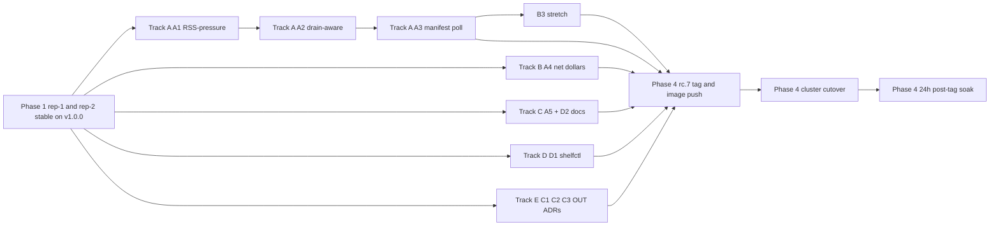

# rc.7 roadmap (2026-05-01 IST)

Forward-looking release plan for `1.0.0-rc.7`. Scope: a Tier-A operational stability spine (5 items lifted from the May 1 post-rc.5 OOM cascade RCA), a Tier-D ops-UX pair, one stretch Tier-B intermediate-table opt-out, and four track-only research ADRs. Tag-and-cut sequence: rep-1 + rep-2 stable on v1.0.0 → Wave 1 prep (parallel-safe) → hot-path Rust serial chain → integration tag rc.7 → post-tag soak. Total wall-clock: ~4-6 weeks; ~6.5 engineer-weeks committed (Tier A + D), Tier B kept as bandwidth-permitting and Tier C as ADR-only.

## 1. Scope

| ID  | Item                                                                                                  | Class                | Effort                              |
| --- | ----------------------------------------------------------------------------------------------------- | -------------------- | ----------------------------------- |
| A1  | RSS-aware admission limiter — extend `shelfd/src/admission_limiter.rs` with VmRSS-pressure throttle    | Rust hot-path        | 1 engineer-week                     |
| A2  | Drain-aware eviction — K8s downward API + SIGTERM handler in shelfd                                    | Rust                 | 1 engineer-week                     |
| A3  | Cold-morning compaction-rewarm un-park via `metadata.json` polling (bypasses JDK-25-blocked SHELF-37) | Rust                 | 2 engineer-weeks                    |
| A4  | Net dollars-saved metric in `crates/shelf-cost` (`gross - amortized pool cost`)                       | Rust + chart         | 3 days                              |
| A5  | Trino tuning recipe shipped as `charts/shelf/examples/trino-catalog-recipe.yaml`                       | Doc / chart example  | 2 days                              |
| D1  | `shelfctl pool-status` — per-pod aggregator (no per-pod `kubectl port-forward` gymnastics)             | Rust                 | 1 engineer-week                     |
| D2  | SHELF-42 A/B tag rollup row added to `shelf-overview-v2.json`                                          | Dashboard            | 3 days                              |
| B3  | (stretch) Intermediate-table opt-out via `iceberg.expire-snapshots.min-retention` check                | Rust                 | 1 engineer-week                     |
| C1  | Multi-region federated shelf-pool — track-only research ADR (this batch)                               | ADR + design doc     | < 1 day per ADR                     |
| C2  | Iceberg v3 Puffin DV-aware admission (SHELF-46 v2) — track-only ADR (this batch)                       | ADR                  | < 1 day                             |
| C3  | Trino native predicate pushdown plugin — feasibility ADR (this batch)                                  | ADR                  | < 1 day                             |
| OUT | Explicit out-of-scope ADR (eBPF `cache_ext` / DAC eviction / Apache Ratis rejected)                    | ADR                  | < 1 day                             |

Tier C + OUT are commit-now ADRs (this PR); execution lives in rc.8+.

## 2. Schedule

Four phases, parallel-safe inside each.

### Phase 1 — rep-1 + rep-2 stable on v1.0.0 (in flight)

**Status (May 1):** rep-1 and rep-2 both running v1.0.0 on `shelf-pool` (4 pods, m5a.4xlarge after the May 1 c6a-drop, 40 GiB pod limit). rep-0 reverted to direct S3 via the held-standby revert MR; rep-3 stays the rollback escape hatch. No image churn permitted in this phase. ConfigMap and overlay edits are fine.

### Phase 2 — Wave 1 prep, parallel-safe (May 2 → May 8)

Two sibling Rust workers + two sidecar workers, all in dedicated `/private/tmp/<task-slug>-<pid>` worktrees per the workspace dispatch convention.

| Track | Items                          | Owner shape                                       | Notes                                                                                       |
| ----- | ------------------------------ | ------------------------------------------------- | ------------------------------------------------------------------------------------------- |
| A     | A1 + A2 + A3                   | one worker, sequential through three Rust tickets | Hot-path serial chain — touches `shelfd/src/admission_limiter.rs`, `membership.rs`, and a new manifest-poller. ≤ 1 hot-path Rust builder concurrent. |
| B     | A4                             | one sidecar Rust worker (`crates/shelf-cost`)     | Distinct crate from `shelfd`; parallel-safe with Track A.                                   |
| C     | A5 + D2                        | one doc/dashboard worker                          | Pure additive; chart example file + Grafana JSON edits.                                     |
| D     | D1                             | one sidecar Rust worker (`shelfctl`)              | Distinct crate; parallel-safe with everything else.                                         |
| E     | C1, C2, C3, OUT                | this PR                                           | Pure markdown; orthogonal to all of the above.                                              |

### Phase 3 — Hot-path Rust serial chain (May 8 → May 18)

Track A is the throughput bottleneck because every ticket touches `shelfd/src/`. Order locked: **A1 → A2 → A3** (A1 lands the RSS-pressure shape that A2 reuses for drain mode; A3 reuses A1's metric surface). One PR per ticket, each squashed before the next branches. Optional B3 stretch slot lands here only if Track A finishes ahead of schedule.

### Phase 4 — rc.7 tag + post-tag soak (May 18 → May 25)

After Phase 2 + Phase 3 are clean:

1. Tag `v1.0.0-rc.7` on `main`.
2. Build + push to GitLab registry (`linux/amd64` only); image visibility flip if needed.
3. Cluster cutover via `kubectl set image` rolling restart on `sts/shelf` ns `alluxio` — ~7 min wall-clock for 4 pods, same shape as today's rc.4 → rc.5 rollout.
4. 24 h post-cutover soak with the standard 7-trigger auto-rollback armed.
5. **Decision gate**: if rep-1 + rep-2 both green for 24 h, restart the rep-0 cutover dispatch; otherwise rep-3 stays the lifeboat and rc.7 carries forward to rc.8.

## 3. Constraints (non-negotiable)

- **No cost-up changes.** Workspace invariant: every property / config / scaling change must be cost-neutral or cost-down. No worker-count bumps, no JVM heap bumps, no shelf-pool scale-out beyond the 6-pod cap. Cost delta must be cited per item in each MR body.
- **≤ 1 hot-path Rust builder concurrent.** Cargo.lock churn would conflict on every other PR; the A1 → A2 → A3 chain is serialised. Sidecar crates (`crates/shelf-cost`, `shelfctl`) are parallel-safe.
- **F2 P2-conditional gate on Foyer 0.22 still parked.** PR #22 stays held until SHELF-35 Belady replay produces ≥ 5 pp lift over the tuned S3-FIFO baseline. No "looks close enough" override; rc.7 does not bump Foyer.
- **JDK 25 absence still blocks SHELF-37 listener.** A3 is designed to bypass that dependency entirely (manifest polling, not event listener). PR #66 stays parked through rc.7.
- **rep-0 stays on direct S3** until rep-1 + rep-2 hit 30 clean days on the m-family + 40 GiB stack. rep-3 is the explicit lifeboat through rc.7; do not cut over.
- **Cutover-window governance applies to every Phase 4 flip.** ≤ 1 helm upgrade per replica per session; locked windows outside the 09:00 – 11:00 IST traffic peak; A/B tag (`X-Shelf-Tag: rc7-flip-N`) on each.

## 4. Per-item acceptance criteria

| Item | Acceptance criteria                                                                                                                                                                                                                                                                                                                                              |
| ---- | -----------------------------------------------------------------------------------------------------------------------------------------------------------------------------------------------------------------------------------------------------------------------------------------------------------------------------------------------------------------|
| A1   | `shelfd/src/admission_limiter.rs` reads `/proc/self/status` `VmRSS:` every 5 s; admission token bucket multiplied by `(1 - max(0, rss_pressure_ratio - 0.7))`. Synthetic stress test (RSS climbed via decoy alloc) drops admit rate ≥ 50 % at 80 % of `rss_target` and ~100 % at 90 %. ADR captures the curve; unit tests verify the multiplier shape.            |
| A2   | shelfd flips `is_draining=true` on SIGTERM **or** when the K8s downward-API watcher sees `kubernetes.io/pod-deletion-marker`; admission gate refuses new writes; reads continue for the 30 s pre-stop window. SHELF-23 resolver removes the pod from peer rings. Integration test gated on `SHELF_INTEGRATION=1` issues SIGTERM and asserts no admits post-flip. |
| A3   | shelfd polls `metadata.json` every 30 s per registered table; on a `summary["operation"]="replace"` snapshot, enqueues `Prefetch(new_files, FOOTER+PAGE_INDEX)` for files whose pre-replace siblings were hot. Steady-state extra GETs ≤ 12 /min on a 100-table fleet; cold-morning S3 GET volume drops ≥ 15 % over a one-week soak vs the rc.6 baseline.        |
| A4   | `crates/shelf-cost` gains `shelf_pool_amortized_dollars_per_hour` config + `shelf_net_dollars_saved_total` metric. Refuses to publish the net counter if the amortized config is unset (anti-overclaim guard, same shape as SHELF-40). Helm value `cost.poolAmortizedDollarsPerHour` documented in `infra/penpencil/charts/shelf/values-prod.yaml`.                |
| A5   | `charts/shelf/examples/trino-catalog-recipe.yaml` ships with `iceberg.metadata-cache.enabled=false`, `iceberg.dynamic-filtering.wait-timeout=3s`, `s3.max-connections=256`, `s3.tcp-keep-alive=true`, plus inline rationale + Trino version pin (`>= 480`). README links to it. CI test asserts the file is valid YAML + matches the rep-1 MR `!17967` set.       |
| D1   | `shelfctl pool-status` lists shelf pods via `kube` crate, parallel-fetches `/stats` + `/metrics` from each, prints aggregated table. No per-pod `kubectl port-forward` required. Dogfood test: replace today's "scrape all pods" runbook step with a single `shelfctl pool-status` invocation.                                                                    |
| D2   | New row in `observability/dashboards/shelf-overview-v2.json`: stat panel for top-5 `ab_tag` values by query count, plus a per-tag `rate(shelf_hits_total)` / `rate(shelf_misses_total)` heatmap. Imports cleanly into the **Data** folder; manual-import note in `docs/rollout-v1/`.                                                                              |
| B3   | (stretch) shelfd reads `iceberg.expire-snapshots.min-retention` per table on first admission; refuses cache admission if `< N days` (default `N=7`). Per-table opt-in via `shelf.cache-policy=transient` table property override. Unit test mocks an Iceberg metadata stream and asserts admission decision matches the policy table.                            |
| C1   | ADR shipped this PR. rc.8 deliverable: 1-engineer-week prototype on local docker-compose (2 MinIO + 2 shelfd + nginx geo-DNS sim).                                                                                                                                                                                                                               |
| C2   | ADR shipped this PR. Trino v3 reader gating documented; rc.7 status `PROPOSED`, ship-or-discard decision deferred to rc.8 once Trino 481+ is in production.                                                                                                                                                                                                       |
| C3   | ADR shipped this PR. Path A / Path B / Path C feasibility recorded; recommendation is Path A with a parallel Path B prototype.                                                                                                                                                                                                                                    |
| OUT  | ADR shipped this PR. Explicit NO with re-evaluation triggers stated for each of eBPF `cache_ext`, DynamicAdaptiveClimb, and Apache Ratis.                                                                                                                                                                                                                         |

## 5. Dependency graph

Track A is the critical path; everything else is parallel and folds into the tag at Phase 4. C-tier ADRs are out of the critical path entirely — they ship now in this PR and document decisions for rc.8+.

## 6. Out of scope (deferred to rc.8 or explicit no)

- **B1 Query-result cache PoC** — deferred to rc.8. Scope (3 – 4 engineer-weeks for a `shelf-result-cache` companion binary + cache-invalidation hard problem) doesn't fit the rc.7 horizon. Tracked in `agents/out/adr/0006-drop-shelf-result-cache-in-v1.md` (still accurate framing) and in the rc.8 backlog.
- **B2 Trino split-affinity plugin** — deferred to rc.8. Today's spike confirmed Trino 481's `getAffinityKey()` is gated on `fs.cache.enabled=true` (the native-S3 path Shelf takes today does not pick up the SPI binding). Either an upstream PR drops the gate or a per-shelf chart workaround is needed; either way it's a rc.8+ engagement.
- **eBPF `cache_ext` page-cache customization** (SOSP 2025) — explicit NO. Rejection rationale captured in ADR-0035 (this PR).
- **DynamicAdaptiveClimb eviction** (arXiv 2511.21235) — explicit NO. Rejection rationale captured in ADR-0035.
- **Apache Ratis / Raft for cache invariants** — explicit NO, redundant with ADR-0001 (no embedded Raft) and ADR-0011 (ETag content-addressing). Captured in ADR-0035.

## 7. Open at write time

- **Wave 1 in flight.** A1, A4, A5, D1, D2 sibling workers dispatched today; this docs PR is one of them.
- **Hot-path serial chain (A1 → A2 → A3) queued.** A1 is the only Track A worker active right now; A2 starts on A1 squash-merge; A3 starts on A2 squash-merge.
- **F2 gate evaluation pending.** SHELF-35 Belady replay output not yet in; PR #22 (Foyer 0.22) remains parked.
- **rep-0 cutover decision gated on rep-1 + rep-2 30-day soak.** Earliest rep-0 retry is post-rc.7 tag, conditional on the 24 h post-cutover soak being green.
