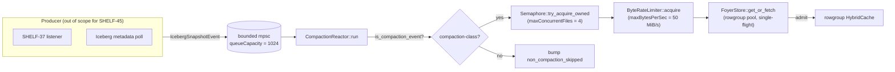

# SHELF-45 — Compaction-aware re-warm reactor

**Status:** implemented (default-off)
**Module:** `shelfd/src/compaction_rewarm.rs`
**Tier:** Tier-3 of the cost-reduction plan — see [`agents/out/03-plan.md`](../../../agents/out/03-plan.md)

## Problem

When an Iceberg table is compacted (`ALTER TABLE … EXECUTE optimize`,
`expire_snapshots`, `remove_orphan_files`), the data files Trino reads
change. shelf's content-addressed cache keys
(`sha256(etag||offset||length||rg_ordinal)` per ADR-0011) automatically
invalidate the old entries on the fresh ETag — that part is correct.
The consequence, though, is that every key the next query asks for
under that table is **cold**. The Apr 27 rep-2 cutover and the
Apr 28 rep-1 chaos window both observed `ICEBERG_CANNOT_OPEN_SPLIT`
spikes correlated with KEDA worker rotations; a compaction event is a
worse, table-concentrated version of the same pattern. AGENTS.md
records that the rep-2 cutover at ~07:30 UTC on Apr 27 stopped a live
Alluxio meltdown (infra failure rate 94 % → 5.7 %); a compaction-class
cold-miss morning is the kind of event the same cutover would have
papered over by accident, and the reactor exists to eliminate it on
purpose.

The deliverable for SHELF-45 is **not** "make compaction faster" — it
is "make the warm window match the snapshot lifetime", so the
dashboard never sees the gap.

## Approach

The reactor is a long-lived Tokio task that consumes
`tokio::sync::mpsc::Receiver<IcebergSnapshotEvent>`, picks out
compaction-class events, and re-warms each `added_files` entry through
the existing `FoyerStore::get_or_fetch` single-flight surface. The
producer side is intentionally **not** in this PR — see "Interaction
with SHELF-37" below.

### Compaction detector predicate

`compaction_rewarm::is_compaction_event` (pure, exposed for testing
and future shelfctl introspection). The predicate is intentionally
narrow:

1. Both `removed_files` and `added_files` are non-empty.
2. `added_files.len() < removed_files.len()` — fewer-and-bigger is the
   structural signature of compaction.
3. `total_bytes(added) ≈ total_bytes(removed)` within
   `byte_equality_tolerance_bps` (default `500 bps = 5 %`).

Append-only INSERTs (`removed_files = []`), pure deletes
(`added_files = []`), partial rewrites that grow the file set, and
rewrites that materially change the byte volume all fall through to
`outcome="non_compaction_skipped"` so the dashboard sees them as
classified-and-ignored, not silently lost.

### Rate-limit math

| Knob                       | Default       | Rationale                                            |
|----------------------------|---------------|------------------------------------------------------|
| `maxBytesPerSec`           | 52 428 800 B  | 50 MiB/s/pod — `nvmeSizeBytes / 1 h` worth of warm.  |
| `maxConcurrentFiles`       | 4             | `origin.max_inflight (128) / 4 = 32` worst-case ratio. |
| `queueCapacity`            | 1 024         | absorbs ~10 minutes of `replace`-class traffic.      |
| `snapshotLagToleranceSecs` | 120           | logs a warning above this; never gates re-warm.      |

`50 MiB/s/pod × 60 s = ~3 GiB/min/pod`. A 5–10 GiB compaction is
absorbed in 2–4 minutes — slower than the producer's commit but
still well inside the morning window the reactor exists to defend.
Higher rates risk crowding out client reads on the same pod's gp3
NVMe; lower rates leak the cold-miss window the reactor is supposed
to close. The property test
`tests::rewarm_semaphore_is_well_below_client_budget` pins the
"≤ origin.max_inflight / 4" invariant so future config bumps cannot
silently break the contract.

### Failure modes

The reactor is **best-effort**. Every failure variant bumps a label
on `shelf_rewarm_errors_total{reason}` and the loop continues:

| Reason               | Triggered by                                                              |
|----------------------|---------------------------------------------------------------------------|
| `iceberg_metadata`   | misshapen event (zero-byte `FileSpec`, missing ETag, bad sizes).          |
| `origin_get`         | `RewarmFetcher::fetch_file` returned `Err(_)` or single-flight propagated. |
| `admission_rejected` | size-threshold policy refused the bytes (rare; re-warm is rowgroup-pool). |
| `pool_full`          | `Semaphore::try_acquire_owned` failed or the bounded mpsc was full.       |
| `cancelled`          | task aborted via `CancellationToken`.                                     |

The reactor never propagates an error back to client traffic, never
poisons the cache (a failed re-warm leaves the old key cold; the
next real query takes the original miss path), and never loses an
event silently — every drop is counted under
`shelf_rewarm_events_total{outcome="dropped_rate_limit"}`.

## Metrics

Six core metrics + one error-reason counter, all in `EXPOSED_SERIES`
and exercised by `metrics::tests::registry_exposes_documented_series`:

| Metric                              | Type        | Labels                |
|-------------------------------------|-------------|-----------------------|
| `shelf_rewarm_events_total`         | counter     | `outcome`             |
| `shelf_rewarm_files_total`          | counter     | `outcome`             |
| `shelf_rewarm_bytes_total`          | counter     | `outcome`             |
| `shelf_rewarm_lag_seconds`          | histogram   | `outcome`             |
| `shelf_rewarm_inflight_files`       | gauge       | `pool`                |
| `shelf_rewarm_queue_depth`          | gauge       | `pool`                |
| `shelf_rewarm_errors_total`         | counter     | `reason`              |

Outcome domain on `shelf_rewarm_events_total`:
`received | compaction_detected | non_compaction_skipped | replayed | dropped_rate_limit`.

Outcome domain on `shelf_rewarm_files_total` / `shelf_rewarm_bytes_total`:
`warmed | failed | skipped_already_warm | skipped_pool_full`.

Reason domain on `shelf_rewarm_errors_total`:
`iceberg_metadata | origin_get | admission_rejected | pool_full | cancelled`.

The `shelf_rewarm_lag_seconds` histogram observes the wall-clock
seconds from `IcebergSnapshotEvent::committed_at` until the reactor
finishes warming the last added file — the dashboard's SLO is the
p95.

## Interaction with SHELF-37

SHELF-37 ships the Iceberg `EventListener` jar that projects every
`QueryCompletedEvent` into a generic Iceberg log table. The same
listener has access to snapshot transitions and is the natural
producer for this reactor — it already carries `(table_id, snapshot_id,
operation, summary)` per Trino's SPI. Once SHELF-37's PR (#66) lands,
the wiring is:

1. SHELF-37 listener emits `IcebergSnapshotEvent` from its `replace`-
   class snapshot tail.
2. The shelfd binary instantiates a producer that wraps a
   `SnapshotPublisher` against the reactor's bounded mpsc.
3. `cache.rewarm.enabled` flips to `true` in the operator overlay.

Until then, the chart's `LoggingEventStream` stub is the safe
default: events received via the diagnostic `with_channel` constructor
are logged at `info` and never forwarded to a re-warm task.

## Interaction with KEDA worker rotation

KEDA-driven Trino worker churn produces a similar cold-miss pattern
(`ICEBERG_CANNOT_OPEN_SPLIT` spikes when a fresh worker connects to a
shelfd pod that does not yet hold the worker's working set). SHELF-45
is **not** a fix for KEDA churn — the worker side has its own keys
and its own warm-up curve. SHELF-45 is a *substitute* for the
compaction-side cold morning, which is a much sharper, single-table
spike than worker churn produces. The two effects are additive on the
dashboard but independent in code.

## Why content-addressed keys still hold

Per ADR-0011, the cache key is
`sha256(etag||offset||length||rg_ordinal)`. The reactor never reuses
old keys: it derives a fresh key for every `added_files` entry from
the new ETag the producer carries. Old entries age out of Foyer
naturally (capacity eviction); they are not actively purged. This is
the same property that lets `EXECUTE optimize` be safe at all — there
is no "stale bytes served" risk.

## Bucket access

Per AGENTS.md, "shelf does NOT require per-bucket mount commands the
way Alluxio does." The reactor reads `s3a://<bucket>/...` paths
directly via the same IRSA-bound origin client `shelfd` already uses
for client traffic; no new credentials, no new mount workflow.

## Alternatives considered

* **Polling `metadata.json` from inside the reactor.** Initial draft
  in `agents/out/SHELF-45-compaction-aware-rewarm.md` proposed a
  30 s S3 poll. Rejected because (a) it adds HMS / Trino-system-table
  load with no clear win over the listener path, (b) it forces the
  reactor to know about the Iceberg metadata schema, which couples
  it to upstream changes. Producer-trait abstraction lets the polling
  worker land later as a sibling impl without touching this module.
* **Bypassing single-flight to "get there first".** Rejected: a
  re-warm racing a real client read defeats the
  `FoyerStore::get_or_fetch` `OnceCell` and double-fetches. Going
  through the same surface lets the second caller (re-warm or client)
  observe the inflight slot and free-ride.
* **Per-rowgroup re-warm.** The current implementation re-warms one
  byte range per file (`offset=0, length=size_bytes, rg_ordinal=0`).
  This is correct for the deliverable but wasteful on very large
  files: in a follow-up we should prefetch the *footer + page index*
  + a small set of hot rowgroups, not the whole file. Tracked as the
  obvious follow-up; the metric panel will tell us when the saving
  becomes interesting.

## Tests

* Unit — `compaction_rewarm::tests` covers the detector predicate
  (append, delete, equal-count, growing, byte-mismatch, zero-byte
  edges), end-to-end reactor behaviour with a synthetic
  `RewarmFetcher`, every error variant
  (`origin_get`, `iceberg_metadata`, `pool_full`,
  `skipped_already_warm`, `skipped_pool_full`, disabled-mode no-op),
  the rate limiter's wall-time math, and the
  re-warm-vs-client-budget property invariant.
* Integration — `shelfd/tests/it_compaction_rewarm.rs` is gated by
  `SHELF_INTEGRATION=1`, boots a real `FoyerStore`, drives a
  synthetic snapshot event with a MinIO-backed merged file, and
  asserts the merged file's content-addressed key is resident in the
  rowgroup pool afterwards.
* Metrics — `metrics::tests::registry_exposes_documented_series` and
  `metrics::tests::metrics_scrape_contains_documented_series_after_touch`
  pin the seven new families on `EXPOSED_SERIES`.

## Operational rollout

1. Land this PR with `cache.rewarm.enabled: false` everywhere.
2. Wait for the SHELF-37 listener PR (#66) to soak for 7 days on
   Tier-1 measurement substrate.
3. Flip `cache.rewarm.enabled: true` on the operator overlay (kept
   commented in `<prod-overlay>/values-prod.yaml`).
4. Watch `shelf_rewarm_events_total{outcome="compaction_detected"}`
   actually move when an `EXECUTE optimize` runs against a hot
   table.
5. Watch `shelf_rolling_hit_ratio_bps{pool="rowgroup"}` against the
   compacted table on the next morning's first batch — the SHELF-45
   acceptance gate is "morning hit ratio ≥ 90 % of pre-compaction
   baseline" (cf. `agents/out/SHELF-45-compaction-aware-rewarm.md`).

If the rollout misbehaves: flip `cache.rewarm.enabled: false` and
helm-upgrade. The reactor returns immediately on `enabled=false`
without spawning any tasks, so rollback is a single-line config change.
